<link rel=”manifest” href=”docs/manifest.webmanifest”>
  

# Axes

| Specifications |
|:---------------|
| ..will be added soon.. ;) |

---

Both the **Go** and the **Neo** are so called 'bed slingers'. Means, the bed moves along the y-axis (back and forth).  
The printhead moves along the x-axis (left and right) and is attached to the x-axis gantry.  
The x-axis gantry moves along the z-axis (up and down).  

The endstop/limit switches of the axes are located at the *minimum* endposition of each axis and are triggered when either axis reaches its limit. The switches of the x- and y-axes are mechanical switches, the one at the z-axis is an optical switch.    
So if you notice that e.g. the motor of the y-axis doesn't stop when the bed reaches the end then you should check if the belonging switch is faulty. 

??? example "Checking The Switches (And Wires)"

    You can check if the switch really isn't working by triggering it manually while e.g. the bed is moving. If the bed doesn't stop, turn off your printer. Check the connectors at the switch and the mainboard if they're still in place.  
    If everything looks fine here, then it's most likey that either a wire is broken or the switch itself is faulty. If you have a multimeter, you could measure if the switch itself is working as well as check the wires. When measuring the wires, move them around as it may be the case that a wire is slightly broken inside of the insulation and that it loses contact in a certain position of the wire itself.   
    If the wire is broken, fix it or install a new one. If the limit switch itself is broken, disassemble the switch from the frame and put in a new one. Wire everything up again and try again triggering it manually to see if it works now.   
  

---

## X-Axis
The x-axis of both the **Go** and the **Neo** is represented by the printhead moving along the x-axis gantry. The moving bracket (where the printed is mounted onto) is belt driven, the motor which drives the belt (6mm wide, GT-2 type) is located at the left side.   
You can adjust the tension of the belt by using the knob at the right side of the aluminum profile where the printhead is guided onto.  
  

---

### Belt Tension
It's kinda difficult to explain the correct belt tension, so you'd have to experiment a bit with that.  
Generally speaking, the belt shouldn't be too tightened up and shouldn't be too loose either.  
If it's too tight, too much pressure will be put onto the motor shaft - if it's too loose though, the belt might slip.  
If you can 'bend' the belt down a bit by putting a some pressure with your finger onto it but you still feel an amount of resistance, then it's a good sign that you're in the right area of tension.    

??? example "Belt Maintenance"

    - Check the belt tension from time to time as it might wear out and lengthen a bit. 
    - Check the teeth of the belt if they are still good looking or if they're worn out or if even some teethe are missing.
    - Check if you can see any cracks at the belt. 
    - Check the gear wheels of the motors which are driving the belts. Are they also looking ok? Did they become loose on the motor shaft somehow?  

---

### V-Slot Wheels Position
The wheels are leading the printhead onto the aluminum profile of the x-axis. They are mounted onto a metal plate where the printhead itself is mounted onto. The wheels run in the V-slot of the profile and therefore they should sit in a good position.    
You can adjust the roller tension by turning the eccentric nut which moves the wheels either towards or away from the aluminum profile.  
However, you probably have to adjust the position of the brackets itself, so check out the section [Tramming The X-Axis Gantry](#tramming-the-x-axis-gantry).

  
??? tip "Adjusting The Position Of The V-Slot Wheels"

    - The wheels shouldn't sit too tight in the V-slot but also not too loose. They should touch the aluminum profile and sit in there pretty tight, but they should be able to roll and move freely - so they shouldn't sit too tight though (sorry, it's kinda hard to explain). On the other hand, they also shouldn't be too loose or far away from the profile which would lead to instability. The printhead shouldn't wiggle but it has to be able to move freely.   
    
  
??? example "V-Slot Wheels Maintenance"  

    - As the wheels will suffer from running on the aluminum and debris can build up, clean the aluminum and the wheels itself from time to time. 
    - After that, add some sythetic grease like white lithium grease or silicone grease (e.g. "Super Lube" from Loctite) onto the aluminum profile where the wheels are running to reduce friction. 
    - *Make sure you're not using WD-40 or grease which has graphite or MoS2 added!* 
    - If you see debris building up pretty quick, it's most likely because the wheels are too close to the aluminum and therefore it's too much friction which leads to a quick wearout. So make sure the wheels are touching the aluminum but they shouldn't be too tight.
    
    !!! warning "Don't Use WD-40 for Lubrication"
    
        Do yourself a favour and *never* use WD-40 for *lubrication* as it's *not* a lubricant and will harm your POM wheels by time!  
        People use to think WD-40 is the perfect solution for pretty much everything, but they aren't aware of the fact that -due to the chemical recipe it's made of- it's absolutely not sufficient for getting parts lubed mid- to longterm. Fact is, that the chemicals inside of it will even wash off any grease or oil, it can harm POM and rubber and so on.  
        As an example: So let's say you want to lubricate your bike chain and use WD-40 to do so, you'll basically *wash away* the existent lubrification  which is inside the chain - therefore the chain will be worn out pretty quick. You'll also harm the sealings. If you don't believe me, make a little test by yourself: take an air baloon, pump it up, spray WD-40 onto it and wait..   

---

### Limit Switch 

The limit switch is located inside of the blue plastic cover at the left hand side (where the motor is mounted at as well).   

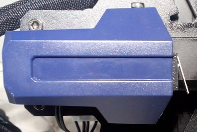  
  
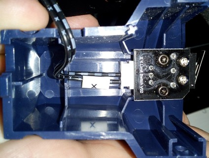  
  
??? example "Limit Switch Problem"

    If you encounter the problem that the limit switch won't be hit sufficiently for being triggered sucessfully, move the printhead manually against it (with the blue plastic cover of the printhead removed) and observe what might cause the problem. Try to adjust the position of the limit switch, so that it can be triggered sucessfully.  
    When using a **Neo**, pay attention to the metal lever of the switch itself as well as to the nut of the left wheel of the gantry. See both areas marked in the following picture.   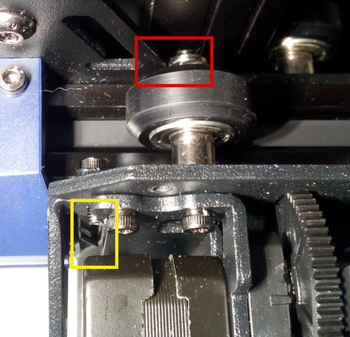   It might be the case that the nut hits the y-shaped metal bracket of the x-axis gantry before the edge of the metal bracket triggers the limit switch. In this case you might want to try to move the limit switch a bit more to the right. If that doesn't work, you probably would have to grind away a bit of the metal of the y-shaped bracket.   
  
---

## X-Axis Gantry
The x-axis gantry is the aluminum profile (plus the corresponding parts) where the printhead is actually running onto.  
 

### V-Slot Wheels Position
The x-axis gantry is moved along the z-axis aluminum profile driven by the z-axis lead screw, guided by v-slot wheels. They run in the v-slot of the z-axis profiles and therefore they should sit in a good position. Means, they shouldn't sit too tight in the V-slot but also not too loose - they should be able to roll and move freely, but they shouldn't be too far away from the profile which would lead to instability.  

You can adjust the roller tension by turning the eccentric nut of the wheel which moves the wheels either towards or away from the aluminum profile.  
Not all of the wheels have eccentric nuts though as the following picture shows, only the two wheels (one at each side) which are facing the inner side of the frame (towards the bed) do have an eccentric nut.  
    

  
Here you can see clearly that only the inner wheel on the left side in the following picture has an eccentric nut, the red circle at the outer wheel on the right side marks the round spacer.  

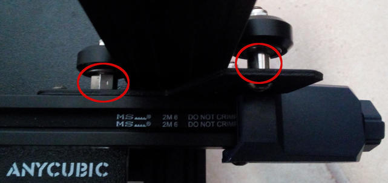
  
However, you might face the problem that you just can't get all of the three wheels at each side to touch the aluminum frame as they should.  
So if you need to adjust the position of the wheels using the eccentric nuts, you might encouter the problem that e.g. the inner wheel and the lower wheel on the outside may sit in the v-slot really nice, but that the third wheel (the upper one on the outside in this example) isn't even touching the aluminum and can be spinned in the air. This also leads to a wobbly x-axis gantry, as you'll most likely be able to move the right part (the side without the lead screw) up and down a bit.   
Whatever you'll try with the eccentric nut of the wheel of the inside (because there's only this one), you won't be able to achieve that all of the three wheels touch the aluminum and sit in the slot like they should, as the eccentric nut only changes the position of the inner wheel towards the frame.  
So - what to do?  
Well, there's a trick, which directly leads us to the process of [tramming the x-axis gantry](#tramming-the-x-axis-gantry).   
          
??? example "V-Slot Wheels Maintenance"  

    - As the wheels will suffer from running on the aluminum and debris can build up, clean the aluminum and the wheels itself from time to time. 
    - After that, add some sythetic grease like white lithium grease or silicone grease (e.g. "Super Lube" from Loctite) onto the aluminum profile where the wheels are running to reduce friction. 
    - *Make sure you're not using WD-40 or grease which has graphite or MoS2 added!* 
    - If you see debris building up pretty quick, it's most likely because the wheels are too close to the aluminum and therefore it's too much friction which leads to a quick wearout. So make sure the wheels are touching the aluminum but they shouldn't be too tight.
    
    !!! warning "Don't Use WD-40 for Lubrication"
    
        Do yourself a favour and *don't* use WD-40 for *lubrication* as it's *not* a lubricant and will harm your POM wheels by time!  
        People use to think WD-40 is the perfect solution for pretty much everything, but they aren't aware of the fact that -due to the chemical recipe it's made of- it's absolutely not sufficient for getting parts lubed mid- to longterm. Fact is, that the chemicals inside of it will even wash off any grease or oil, it can harm POM and rubber and so on.  
        As an example: So let's say you want to lubricate your bike chain and use WD-40 to do so, you'll basically *wash away* the existent lubrification  which is inside the chain - therefore the chain will be worn out pretty quick. You'll also harm the sealings. If you don't believe me, make a little test by yourself: take an air baloon, pump it up, spray WD-40 onto it and wait.. 

---

### Tramming The X-Axis Gantry

!!! warning "'Tramming' vs. 'Leveling' The Gantry"  

    Because I got attacked, harrassed, insulted and called names for using the correct term "tramming" instead of the misleading and technically wrong term "leveling", let me make something clear at this point.  
    
    What we do here is a procedure called "tramming". 
    We (try) to get the machine and certain parts of it aligned perfectly, like axes and parts being suqare, parallel, perpendicular and equidistant *towards each other*.  
    For example, we try to set up the frame being mounted perfectly square, the z-axis frame being perpendicular to the base frame, the x-axis gantry being perpendicular to the z-axis frame and the bed being parallel and equidistant to the x-axis gantry and the printhead/nozzle.  
    It's a technical term which is also used at CNC machines for example and this is the correct nomenclature. And as a matter of fact, this is also the case with 3d printers. Point.  
    
    "Leveling" though is the process of bringing something like a shelf, a table or a framed picture hanging at the wall into the position that it's *perpendicular to gravity* so to say. Most of the time you do so by taking a bubble level or a self-leveling laser. But this is NOT how you 'level' the bed of your 3d printer for example.  
    Yes, I'm highly aware of the fact that the majority of the 3d printing community uses the term 'leveling', that people say "Level your bed!" and that the marketing guys and gals of the companies even use the (even more misleading!) term "Automatic Bed Leveling" (which is even worse as it suggests that the process will actually 'level' the bed itself - which it obviously doesn't). But that doesn't mean that I have to follow that misleading road.   
    So besides the fact that this isn't the correct nomenclature (seriously, I'm not the grammar police - I'm a German guy who speaks a little bit of English..), my 'problem' with this term is that it's just really misleading!  
    How many beginners are pulling out their bubble level, put it on the bed to check if it's leveled and maybe even shim out the table the printer stands on - just to come to the conclusion that their bed is leveled? Believe it or not: many - whether you came across those users while trying to help them or not. You can use a 3d printer on a tilted table - if the printer is trammed, it'll still print fine.   

    So to all those haters out there: yes, I will continue to use the correct term "tramming", no matter how much you'll attack and try to insult me.  
    And no, I don't do it because I want to show the world that I know the correct term, I do it because I want to avoid that beginners become frustrated because they just get it wrong. 

It's advisable to tram the x-axis gantry to either the bed itself or the frame, depending on the type of spacers of the bedmount. By doing so, you make sure that the bed and the gantry are parallel to each other and therefore the distance of the nozzle to the plate is pretty much the same all along the x-axis.  
  
As the printers come with rigid spacers (the black plastic pieces between the bedplate and the bed gantry), you aren't really able to "tram" the bed unless you replace the stock spacers with [adjustable ones](bed.md#different-spacers).    
The problem with those rigid stock spacers is, that they most likely aren't all of the same length/height - so I'd recommend to at least dismount them, check if they're all of the same height and if they aren't, sand them down to an equal height. By doing so you can at least make sure that you won't have a tilted or warped bed caused by spacers of different legth. See the section ["Tramming The Bed"](bed.md#tramming-the-bed) for further information and instructions.   
*Make sure to take care of this before actually starting to tram the x-axis gantry, as you'll tram it in relation to the bed.*  
   
After taking care of the spacers (either the stock ones or after getting yourself new adjustable ones), reassemble everything. Now you can proceed tramming the x-axis gantry:  

- If you're using the *rigid stock spacers*, tram the gantry in relation to the *bed* itself.  
- If you're using *adjustable spacers*, tram the gantry in relation to the *frame* itself and then tram the bed in relation to the nozzle at different positions (see the section ["Tramming The Bed"](bed.md#tramming-the-bed) for further information and instructions about it).     

Please see the expandable textbox below for further instructions about how to tram the x-axis gantry.  

??? example "Tramming The X-Axis Gantry And Adjusting The Wheels"  

    When it comes down to tramming the x-axis gantry, up to me one should differ between tramming it in relation to the frame of the printer and in relation to the bed. Depending on which spacers are being used, you should either do the one or the other:  
    
    1. Tram in relation to the *bed*, if you're using the stock spacers, because you can't really "tram" the bed itself. *Make sure you checked the rigid stock spacers of the bedmount for an equal height before tramming the gantry though!* If they're not all of the same height, I'd recommend to sand them down to the height of the shortest spacer.  
    
    2. If you've swapped the stock spacers and are using *adjustable* ones, like silicone spacers or springs, then you should tram in relation to the frame itself to make sure everything is square and perpendicular like it should be. Of course the whole frame has to be assembled correctly first, so make sure the base frame really is mounted square and the aluminum parts of the z-axis frame really are perpendicular to the base frame!  
      So follow the steps being mentioned in the following, but instead of placing two identical objects onto the bed, place them onto the base frame and rest the aluminum part of the x-axis gantry onto them. After bringing those y-shaped metal brackets into the correct position, make sure to retighten the screws while the aluminum frame of the x-axis is perpendicular to the aluminum frame of the z-axis at both sides.  
      After that, tram the bed itself to the x-axis gantry by adjusting the height of the bed by using the screws and adjust it at the four corners to the same distance of the nozzle (e.g. 0.1mm by using a feeler gauge or a sheet of paper).  
    
    *Note: the following description is for tramming the x-axis gantry in relation to the bed itself when using the rigid stock spacers!*  
    *If you're using adjustable spacers, the procedure is pretty much the same, you just have to put two pieces of equal height onto the frame of the printer (where the z-axis aluminum frame is mounted onto) and rest the x-axis gantry onto them instead of placing those pieces on the bed itself!*   
    
    - So in order to *tram the x-axis gantry in relation to the bed*, so that both are as parallel as possible, take two parts of equal height like cans for example and place them onto the left and right side of the bed.  
    - Lower the x-axis gantry until the aluminum frame of it touches the can(s).  
      Make sure to have the cans positioned as far to the sides of the bed as possible, but only *that* far that *only the aluminum frame of the gantry touches them!* This is crucial - you *don't* want those y-shaped metal brackets touch the cans at all!  
      The following picture shows the crooked gantry resting on one can (the right one), where there's a noticeable gap between it and the left can.  
      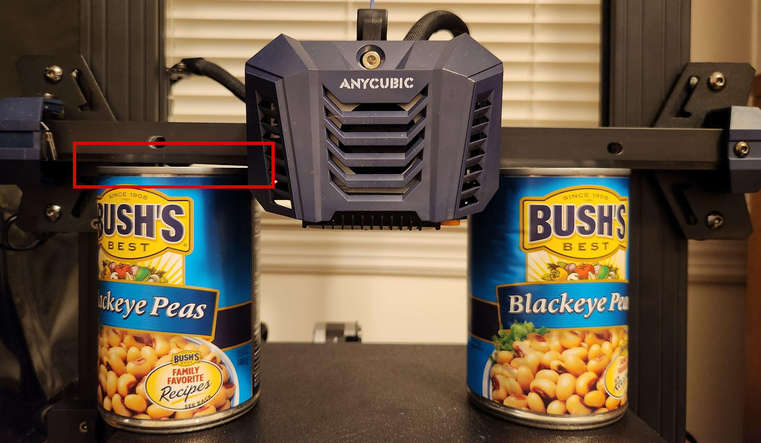  
    - Loosen the coupler between the z-axis motor shaft and the lead screw at one side. I'd suppose to loosen the upper side where the lead screw is mounted into. Then turn the lead screw manually by hand counter clockwise to get it lifted up outside of the coupler.  
      By doing so you achieve that there isn't any kind of force being added to that side of the gantry which will lead to a false result. You want the gantry to rest on the cans *only* by it's own weight!   
     - *Note: if you didn't take care of cleaning and lubing the lead screw yet as well as checking the whole z-axis lead screw system for perfect vertical alignment and the anti-backlash nut for a correct installation, this is the perfect time to do so! Don't skip this! Please see the belonging textbox below in the section ["Z-Axis"](#z-axis).*   
    - Now loosen the two hexagon socket screws at each side of the aluminum frame of the gantry which are holding each of the Y-shaped metal plate (where the wheels are mounted onto, at the backside so to say) against it. Don't take them out (!), just loosen them a bit. You need to turn the printer around for being able to actually get access to those screws. The following pictures show the locations of those screws.  
      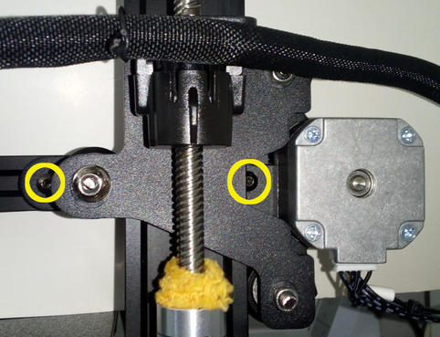  
      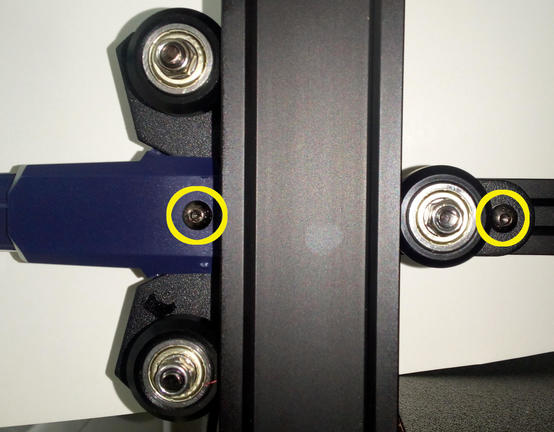
    - With those brackets being loose, adjust their position by slightly wiggling and turning them until the outer wheels of them touch the aluminum frame of the z-axis. Do one bracket at each time.  
      Don't pay (too much) attention to the inner wheel yet though, as you'll adjust the position of it in the following step. Remember: right now you want to achieve that the bracket is in the position that both of the two outer wheels touch the aluminum frame.  
      Once you found that perfect position of that bracket, hold it in place with one hand and adjust the position of the inner wheel now by turning the eccentric nut in the correct position. You want to achieve that all three wheels touch the frame.  
        
      *Note: with adjusting the position of the inner wheels by turning the eccentric nut (now and later as well), you only adjust the pressure and how tight the wheels sit and run along the z-axis frame. The position of the outer wheels only can be achieved by positioning them manually as described.*  
    - After having one side repositioned, repeat the process at the other side.  
    - After you did this, pay attention to the aluminum frame of the x-axis gantry again. You want it to rest completely equal on both cans, as the following picture shows.  
      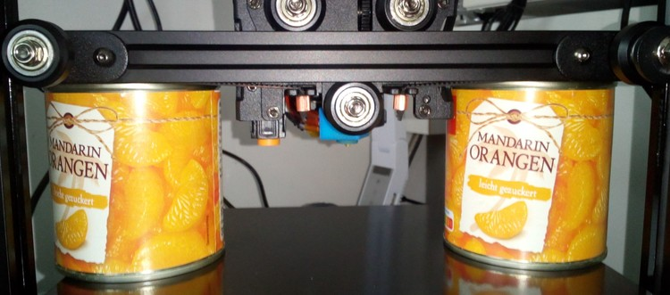   
      For achieving this, you might have to move the brackets a bit up or down to get everything aligned up well.  
    - Once you aligned everything perfectly, retighten the two hexagon socket screws at each bracket again to secure them onto that aluminum frame of the gantry.  
    - Now all of the wheels should touch the aluminum frame of the z-axis and the x-axis gantry should be as parallel to the bed as possible. The y-shaped brackets should be at pretty much the same position as well.  
    - Now that you still have the lead screw dismounted, move the gantry up and down along the z-axis.  
      Does the movement feel smooth and easy-going? Or do you feel any kind of (unusual) resistance?  
      Is the gantry somehow sloppy on one side, or is it 'sturdy' and you don't have unwanted 'play' at one side?  
      If necessary (like if it's either moving not smooth enough or if it feels sloppy), slightly adjust the position of the inner wheel and check everything again.  
    - Once everything seems to be perfect, reinstall the lead screw.  
    - When everything is set up again, move the z-axis up and down by using the control unit. Again, everything should move smooth. Home the z-axis and you should be good to go!   
    
    Congratulations, you just trammed the x-axis gantry!   
    

---

## Y-Axis
The y-axis of both the **Go** and the **Neo** is belt driven (GT-2 type, 6mm wide).  
The motor which drives the belt is positioned at the back of the printer.  
  
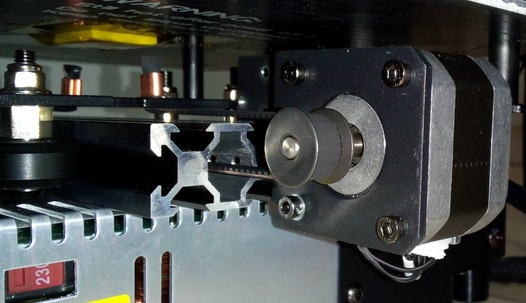

You can adjust the tension of the belt by using the knob at the front side of the aluminum profile where the bed is guided onto.   
The x-shaped plate for the bedmount itself has v-slot wheels which are running in the v-slot of the aluminum profile.  
The following picture shows the aluminum profile of the y-axis with the knob for adjusting the belt tension at the front.   
  
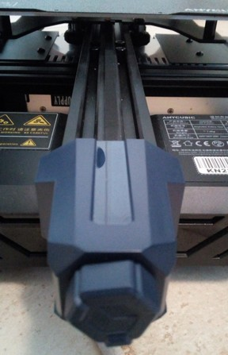
  
---

### Belt Tension
It's kinda difficult to explain the correct belt tension, so you'd have to experiment a bit with that.  
Generally speaking, the belt shouldn't be too tightened up and shouldn't be too loose either.  
If it's too tight, too much pressure will be put onto the motor shaft - if it's too loose though, the belt might slip.  
If you can 'bend' the belt down a bit by putting a some pressure with your finger onto it but you still feel an amount of resistance, then it's a good sign that you're in the right area of tension.      
    
??? example "Belt Maintenance"

    - Check the belt tension from time to time as it might wear out and lengthen a bit. 
    - Check the teeth of the belt if they are still good looking or if they're worn out or if even some teethe are missing.
    - Check if you can see any cracks at the belt. 
    - Check the gear wheels of the motors which are driving the belts. Are they also looking ok? Did they become loose on the motor shaft somehow?      

---
    
### V-Slot Wheels Position
The wheels are leading the bed onto the aluminum profile in the middle. They run in the V-slot of the long profile in the middle underneath the bed and therefore they should sit in a good position. Means, they shouldn't sit too tight in the V-slot but also not too loose - they should be able to roll and move freely, but they shouldn't be too far away from the profile which would lead to instability.  
You can adjust the roller tension by turning the eccentric nut which moves the wheels either towards or away from the aluminum profile. Not all of the wheels have eccentric nuts though as you might be able to see at the following picture.  
  

   
??? tip "Check The Screws Of The Bedplate And The Gantry Of The Bed"

    - Check if the screws are all tightened up. Be careful though to not overtighten the screws of the Bedplate as you would compress the little spacers underneath it and therefore the plate may become warped. On the other hand, if you see that your bed is warped somehow or that the bed is much more off in certain areas or at one side, you can check if the screws in that area might be too tightened up.  
    - Check if the bedplate itself is somehow wobbling. Not only sideways/horizontally, but also up and down/vertically. If so, not only check the v-slot wheels and maybe adjust their fitting using the eccentric nuts, also check if the screws of the gantry of the bed where the wheels are mounted to are tightened up. As an example: at my **Neo** the bed was wobbling up and down in one certain area - after checking the screws and tighten them up everything was sturdy as it should be.         
   
??? example "V-Slot Wheels Maintenance"  

    - As the wheels will suffer from running on the aluminum and debris can build up, clean the aluminum and the wheels itself from time to time. 
    - After that, add some sythetic grease like white lithium grease or silicone grease (e.g. "Super Lube" from Loctite) onto the aluminum profile where the wheels are running to reduce friction. 
    - *Make sure you're not using WD-40 or grease which has graphite or MoS2 added!* 
    - If you see debris building up pretty quick, it's most likely because the wheels are too close to the aluminum and therefore it's too much friction which leads to a quick wearout. So make sure the wheels are touching the aluminum but they shouldn't be too tight.
    
    !!! warning "Don't Use WD-40 for Lubrication"
    
        Do yourself a favour and *never* use WD-40 for *lubrication* as it's *not* a lubricant and will harm your POM wheels by time!  
        People use to think WD-40 is the perfect solution for pretty much everything, but they aren't aware of the fact that -due to the chemical recipe it's made of- it's absolutely not sufficient for getting parts lubed mid- to longterm. Fact is, that the chemicals inside of it will even wash off any grease or oil, it can harm POM and rubber and so on.  
        As an example: So let's say you want to lubricate your bike chain and use WD-40 to do so, you'll basically *wash away* the existent lubrification  which is inside the chain - therefore the chain will be worn out pretty quick. You'll also harm the sealings. If you don't believe me, make a little test by yourself: take an air baloon, pump it up, spray WD-40 onto it and wait..    

---

### Limit Switch

The limit switch for the y-axis is mounted at the back right before the motor, the gantry triggers the switch when moved completely to the back.  

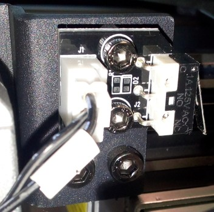

---

## Z-Axis
The z-axis of both the **Go** and the **Neo** is driven by a single lead screw. The lead screw has 8mm in diameter with 8mm lead ('distance' of one complete rotation), 2mm pitch and 4 starts and has a length of 350mm (it's actually the kind of lead screw which is used pretty much everywhere in these kind of machines).  
This rod is mounted to the 5mm shaft of the motor by a coupler at the bottom.  
The top end of the rod is completely unguided, in between it's guided and secured by a POM anti-backlash nut which you can see at the following picture -  it's the black plastic part mounted to the black steel bracket.  
  

   
??? example "Dis- and Reassembling The Z-Axis Lead Screw System"   

    If you need to dis- and reassemble assemble the z-axis lead screw system, there are a few things that one should be aware of. Besides that, the necessary steps are pretty easy and self-explaing, so I'll go over them just really quick.  
    
    **Disassembling:**  
    - First, you should somehow fixate the gantry of the x-axis to get the load off of the lead screw. You can do so by e.g. putting two soupcans onto the bed, each on one side (left/right) and then lower the gantry until it rests onto them. Or you can move the gantry up and fixate it with some velcro straps or cable ties as shown in the picture below.     
    - Now unplug the wire from the stepper motor, just to be on the safe side. The printer itself is also switched off of course.  
    - Loosen the two screws at the coupler which conects the motor shaft and the lead screw. 
    - Now you can turn the lead screw by hand to screw it out of the anti-backlash nut. After you completely took it out, dismount the anti-backlash nut from the holder at the frame as well.  
      If you fixated the x-axis gantry at the top like shown in the picture above, you can also just screw the lead screw a bit higher into the anti-backlash nut so that it comes out of the coupler and then you just dismount the anti-backlash nut from the holder at the frame. After that you can take out the lead screw with the nut still on and take off the nut then.  
    - Take off the coupler from the motor shaft as well for being able to inspect everything.  
    
    **Reassembling:**  
    - To reassemble everything, just follow your steps backwards.   
    However, there are a few things you should pay attention to now:  
    - Make sure the motor shaft and the bottom tip of the lead screw are free of oil or grease to avoid slipping of the coupler.  
    - Mount the coupler to the bottom of the lead screw first and tighten the screw. Then put it onto the motor shaft and tighten the screw. The coupler should not move or wiggle on either part.    
    - When installing the *anti-backlash nut*, make sure you *press it together* firmly while inserting the lead screw, so that the spring inside these two parts of the anti-backlash nut is completely compressed and loaded. 
    - Before finally installing the lead screw, loosen up the screws of the motor holder a bit so that the motor itself can move a bit on the horizontal plane. Then install the lead screw, align everything, screw the anti-backlash nut to the belonging holder and align the motor once again. Then finally tighten up the screws of the motor mount. By doing so you do the best you can to get the parts vertically aligned as much as possible.  
   
??? example "Lead Screw Maintenance"

    - Make sure the coupler is mounted correctly.    
      Check from time to time that the coupler didn't come loose somehow. 
    - Make sure the rod is clean, there shouldn't stick debris or dirt on it as it could/would block the movement. The following picture shows a partially clogged thread due to debris of the anti-backlash nut.   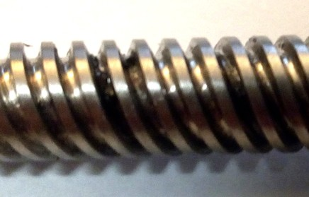   In this case the motor was still able to move the rod across it, but you could notice a tiny jerk at that point.  
    - If you need to clean it, it's advisable to disassamble the whole rod system including the coupler and the anti-backlash nut. The following picture shows the **Neo** where the coupler, rod and nut are dismounted.   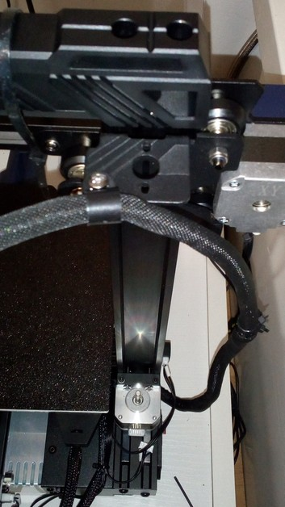   See the other expandable box for some guidances about dis- and reassembling the z-axis lead screw system.  
    - Spray e.g. WD-40 on the rod to loosen old sticky oil and debris. Then take a toothbrush or something like that for being able to reach the bottom of the thread also and clean it up. Make sure to not leave any particles from the anti-backlash nut like shown in the picture below or any dirt stuck on it.   
    - After this procedure, clean the WD-40 off of the rod by using e.g. car break cleaner or silicone remover spray. It'll wash off everything, you can also use an old cloth to wipe it (but make sure that no textile fibres will stick in the thread somehow). 
    - After you cleaned and dried it, inspect the rod and the anti-backlash nut.  
      Are there any dents in the thread or any kind of deformation that shouldn't be there? Is it really straight or is it somehow bent (roll it across a flat surface)? If so, it would be best to get a new lead screw and replace it.   
      Is the anti-backlash nut worn out like in the picture shown below? If so, replace it, maybe use a brass one instead (note: until now I didn't find a brass one that fits the distance of the holes though).      When you mount the anti-backlash nut to the belonging part of the frame, I personally like to not tighten up the screws completely to allow a bit of a movement on the horizontal plane.  
    - If everything is fine though and you want to mount the lead screw to the printer again, add a little lube to the rod. Don't be excessive here and drown it with oil - just use a tiny bit to make it glide better.  
    *Don't use WD-40 or grease which contains graphite or MoS2!*   
    I personally like to use PTFE spray first, let it dry and then put some synthetic lube on which is made for mountainbike chains as it uses to stick a bit better onto the metal. If you have, you can also use synthetic grease like PTFE or silicone grease ("Super Lube"), it should work even better.  
    You can draw a line of oil all along one side of the rod from the bottom to the top and then put the rod between your fingers and turn it. By doing so, the excessive oil will build up at your fingers and will also reach the bottom of the rod. Wipe off any excessive amount of oil afterwards again - you don't want to have oil dripping down on your motor later!  
    Tip: to avoid dripping oil down to the motor, I personally wrap a pipe cleaner around the rod right above the coupler. If by time a drop or two will move down, the pipe cleaner will absorb it.     
    - Before installing the rod into the coupler of the motor again, clean the last inch of the bottom again by using the car break cleaner and the cloth. Try to get it as much degreased as possible, so that it doesn't start to slip inside of the coupler later. 
    - When you're done reassembling everything and you home the printhead, you only should hear the low noise of the turning motor now - so now grinding noise from the anti-backlash nut or something like that.  
    
    !!! warning "Don't Use WD-40 for Lubrication"
    
        Do yourself a favour and *never* use WD-40 for *lubrication* as it's *not* a lubricant!  
        It's perfectly fine for washing off old oil from the threaded rod, but it's *not* a sufficient lubrification!  
        People use to think WD-40 is the perfect solution for pretty much everything, but they aren't aware of the fact that -due to the chemical recipe it's made of- it's absolutely not sufficient for getting parts lubed mid- to longterm. Fact is, that the chemicals inside of it will even wash off any grease or oil, it can harm POM and rubber and so on.  
        As an example: So let's say you want to lubricate your bike chain and use WD-40 to do so, you'll basically *wash away* the existent lubrification  which is inside the chain - therefore the chain will be worn out pretty quick. You'll also harm the sealings. If you don't believe me, make a little test by yourself: take an air baloon, pump it up, spray WD-40 onto it and wait..  
  
??? example "Changing The Coupler"

    It might be a good idea to change the coupler as the one which comes with the printer doesn't compensate any misalignement of the motor shaft and the lead screw. So if they aren't in a perfect vertical alignment, it will result in shear forces, increased wear of the anti-backlash nut and even may cause jamming. The following picture shows the stock coupler that is mounted.      Here is a picture of a flex coupler I replaced the stock coupler with.      When mounting it, I put a ball of a ball bearing between the motorshaft and the lead screw, so that the flexcoupler won't be pushed together by the weight of the z-axis. I also added ball bearings underneath the flexcoupler to keep the main load off of the motorshaft and transfer it to the motorhousing. Additionally, I also added a nylon washer of the correct thickness underneath the motor itself as it was hanging in the air, only held by the two screws of the motormount at the z-axis aluminum profile.      
    If you want to change the coupler, you'll need to get a coupler which suits 5mm on one side and 8mm on the other side as the motor shaft is 5mm and the rod is 8mm in diameter. Make sure you *don't* get a coupler which uses a grub screw that holds onto the shaft and rod itself, you need to get a coupler which uses some kind of a clamp mechanism as the stock one. The reason is simple: the motor shaft is round, it doesn't have a flat area where a grub screw needs to be screwn onto. Same goes for the lead screw itself.    
    
??? example "Changing The Anti-Backlash Nut"  

    If the anti-backlash nut that came with the printer is worn out like shown in the picture below, you should look out for a new one.      The nut shown at the picture above is still useable though as it still sits tight on the rod. However, sooner or later the debris will come off again and stick on the rod which may causes jams or stuttering of the z-axis movement.     
    If you find a spring tensioned anti-backlash nut made of brass, you can also use that. However, until now I didn't find one which fits the distance of the holes though.  
    When you (re-)install the anti-backlash nut, make sure that you press both parts together when putting the lead screw in. There's a little spring between the upper and the lower part of the nut which is there to prevent the backlash. This spring needs to be pushed together during the installation, so that there's tension and both parts of that nut system are being pushed away from each other when installed.  
        
    !!! tip "Oldham Coupler"
    
        If you find one that fits, you can mount an Oldham coupler additionally between the nut and the holder of the frame. That'll allow horizontal movement of the rod which avoids jamming, stuttering or banding caused by the z-axis.  
  
---

### Limit Switch

The optical limit switch of the z-axis is located at the bottom of the left z-axis aluminum profile.  

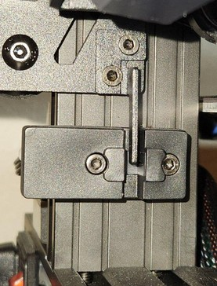  

The little metal lever that triggers the switch is mounted to the left bracket of the x-axis gantry. When the gantry moves down, the lever slides into that slot of the optical switch and triggers it.   

---
  
### MOD: Bearing Block At The Top 
Some users stabilize the rod of the Z-axis by adding a bearing block at the top. That's basically a holder/aligner with a ball bearing in the center which sits on top of the lead screw and mount the holder to the gantry to eliminate wobbling of the lead screw. For doing so, they print a construction and add a ball bearing, there are different STL files available for this solution.  
  However, as much as it may seem useful at first sight, I personally vote against this. In my opinion it's better if the top of the lead screw can move freely to avoid putting extra pressure on the lead screw, the frame and associated parts - especially in this case where we don't have a high precision type of construction and parts. If the guidance at the top doesn't allow at least minimal movement, then this could result in shear forces and even in bending the lead screw itself which would cause jamming or banding caused by the z-axis, also the anti-backlash nut will mist likely wear out earlier.  
  
??? note "Analogy To Fixed vs Free End Of The Z-Axis"
  
    The reason for this is quite simple, yet it seems that people aren't aware of it, so I'll try to explain it with an analogy.  
    Think of the z-axis lead screw like it's a pool cue which is curved like the really bad ones you have to play with in certain bars. So when you put the cue on the table and roll it - what happens? It'll bump and stutter, there won't be a smooth movement, right?  
    So now imagine a friend is holding the top and the bottom of it in place while you're holding it somewhere at the middle for example. Your friend here is the coupler and the holder at the top of the lead screw, you're the anti-backlash nut.  
    So when your friend tries to turn the cue by rotatin it at the bottom while both of you still hold the other two spots - what happens? Will you as the 'anti-backlash nut' feel the wiggle and the forces or will it turn smooth? Exactly, you'll feel it - depending on how much the cue is bent and where exactly you placed your hand you'll either feel it stronger or weaker.  
    So now let's place this cue on the edge of the table, so that only the bottom part lays on it. Again you place your hand somewhere in the middle and hold the cue tight, the end of the cue is just in the air.  
    So when your friend rotates the cue again at the bottom - what will happen? Exactly, the end of the cue will wiggle around and you won't feel the forces that strong anymore like before.  
    Now you and your friend still hold the cue at these positions, but both of you allow a tiny bit of movement, like you allow to move your arms just a tiny bit, following the movement of the cue. Again your friend rotates the cue at the bottom while the top of the cue can still wiggle around in the air. What will happen? Exactly, you as the 'anti-backlash nut' guy won't feel pretty much any forces or stuttering anymore.  
    I know, using analogies isn't always a good idea to explain things, but I hope it became at least a bit more clear to you why (imho) the end of the lead screw shouldn't be rigidly fixed and why I suppose to use a flexible coupler at the bottom and an Oldham coupler in the middle where the anti-backlash nut is mounted to the frame.   
  
---
    
### MOD: Dual Driven Z-Axis 
The following mods show possibilities of adding a second lead screw and therefore avoid the potential sagging/lagging of the right part of the x-axis gantry as much as possible.  

---

#### Driven By Two Z-Steppers
Reddit member [DrumsticknDrumstick](https://www.reddit.com/user/DrumsticknDrumstick/) upgraded the z-axis of his **Neo** to a dual drive, the solution fits both the **Go** and the **Neo**: [Kobra neo/go dual Z mod](https://www.reddit.com/r/anycubic/comments/1083sr2/kobra_neogo_dual_z_mod/)  
  Due to the pretty much same construction of the frame, you should also be able to use mod kits that fit the Creality Ender 3 for example, but here a user mentioned that the lead screw appears to not be the same like at the **Go** or the **Neo**. I can't judge this as I didn't get myself such a kit and didn't compare them.  

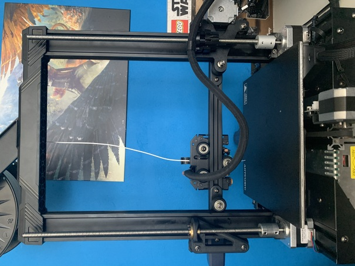

Unfortunately, when using the stock mainboard (which only has one stepper driver for the z-axis) you can't drive each stepper motor with it's own stepper driver and therefore can't use the G-Code command "G34 - Z steppers auto-alignment".  

---

#### Driven By A Timing Belt
User ["chiz"](https://www.printables.com/de/@chiz_m) remixed the abovementioned solution from DrumsticknDrumstick and came up with a [timing belt driven dual z-axis](https://www.printables.com/de/model/462038-anycubic-kobra-go-dual-z-mod-with-timing-belt).  
In this case the stock lead screw is driven by that one motor only, the second lead screw will then be driven by a timing belt.  

If you go with this solution, I'd highly recommend to use an "Oldham Coupler" an the left bracket of the x-axis gantry where the anti-backlash nut is mounted to. The reason is simple: At that side the lead screw is fixated at three points: the top, the bottom and the middle (which is moving). So if the lead screw is slightly bent or any vertical misalignment is given, problems like a jammed axis and artefacts in the prints (like z-banding) might occur. 
      

