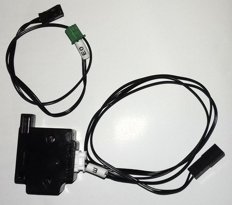

<link rel=”manifest” href=”docs/manifest.webmanifest”>

# Filament Sensor

| Specifications |
|:---------------|
| Switch: NO (normally open) |
| Voltage: 24VDC |
| Connector: JST-XH 2.54 (male, 2 pins) |  

The filament runout / break detection sensor available from Anycubic is optional, it doesn't come with the printer right away.  

The sensor is basically a switch inside a housing, which will be triggered and closes the contact when filament is fed through.  
The switch is NO (normally open) and the connector for plugging it into the mainboard's connector is a JST-XH2.54 (male, 2 pins).  

It is pretty much plug&play as it comes with the specific wires and plugs.   

  

After stripping in the wires and lead them down to the mainboard, you then have to plug it into the corresponding socket which is this green two pinned one in the following picture. It's easy to find as it's the only one available.  

  

  

See the chapter ["Mainboard"](mainboard.md#trigorilla-v_306-stock) for a picture of the whole mainboard for getting a better overview where the connector is located.  

After you connected and mounted the sensor, you lead the filament through it which then closes the switch and the electrical circuit. If the filament runs out because it broke or the spool is empty, the switch will open and the printer will pause.  

Anycubic has a more detailed installation instruction on their blog available:  

- [Installation at the **Go**](https://www.anycubic.com/blogs/3d-printing-guides/how-to-install-filament-runout-sensor-for-anycubic-kobra-go)  
- [Installation at the **Neo**](https://www.anycubic.com/blogs/3d-printing-guides/filament-sensor-upgrade-for-anycubic-kobra-neo)  

  
??? info "Red Glue Across All Connectors"

    When you look at the mainboard, you'll see some red glue spread across all connectors. That's just for securing the connnection. You can get that stuff off by carefully pulling it off. It works better if you warm up that stuff *a little bit* for making it more flexible, a hair dryer is good for that. It then becomes a bit softer and easier to be pulled off. Don't heat it up too much though as it'll become too soft then!  
    You can also use a thin screwdriver to lift up a part of that stuff and then use some tweezers to grab it.    
    
    However, be *very careful* to  
    
    - not harm the mainboard by slipping off with the screwdriver or tweezer!  
    - not overheat the mainboards of parts of it when heating up that red glue!  
    - not rip off the heatsinks of the stepper drivers!  
      This can happen really quick as they're just glued onto the stepper drivers with some thermal paste and the red glue is usually spread across the fins of the heatsinks as well!  
      So *if* you have to pull off that stuff from those connectors of the motor wiring, then *make sure that you press down the heatsink with your finger when trying to pull that stuff off!*  

  
??? info "False Positive Detections" 

    Some users reported and complained about false positive detections and therefore paused prints even though there was filament loaded.  
    This might just be a small problem which probably could easily be fixed by bending the little lever of the switch inside of the sensorbox so that there's more pressure onto the filament, but I personally didn't install my sensor yet and didn't check that.  
    
    

