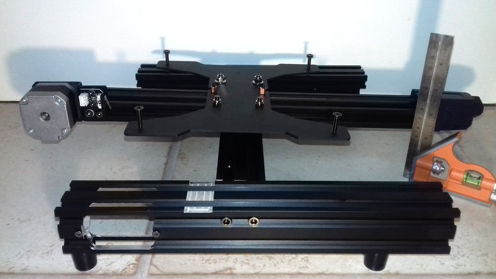

<link rel=”manifest” href=”docs/manifest.webmanifest”>

# Introduction
This hardware section covers the hardware topics like the mainboard, the printhead and so on.  
You'll find pictures and notes about the parts, how to disassemble or maintenace them and sometimes also suggestions for spare parts which could be used. Just click on the belonging chapter of the part where the desired part is located at, so e.g. in case you're looking for informations about the hotend, see the chapter "Printhead".  

If I found mods which seem meaningful to me and which fit in the certain area where the part is located at the printer, I'll list them at the end of the belonging chapter (like e.g. a link to an STL file of an upgraded fan duct can be found in the subchapter "Printhead" and so on).  
Mods or STL files which don't fit in a special 'area' of the printer that I made a subchapter about can be found in the subchapter "Other" (like e.g. raisers for the whole printer to stand higher).  
  
Because you're entering the hardware part right now, there is something I really want to recommend to you and I cannot emphasize it enough: 
*before you even start printing anything, check the whole construction first.*  
*Check the whole frame if everything is square, rectangular and perpendicular, check all screws, bolts, belts, wheels, electrical connectors - really just everything.*  
*And (really important): also disassemble the lead screw system, clean it and lubricate it and pay attention to vertical alignment when reassembling!*   
  
You might think now "Why should I waste my time with that? I assembled the **Go** by myself / I got the preassembled **Neo** and why should I even disassemble the lead screw system?!?" - and I understand that.  
Sure, you want to dive right into the beautiful ocean of 3D printing. And you will. But as with jumping into the unknown ocean from a cliff high above, you need to assure that everything is safe. And in this case with your new 3D printer it's actually not only that.  
The point is: even if you got the preassembled **Neo**, not everything might be assembled and mounted correctly. Some bolts or screws might not be tight enough or might be overtightened. The wheels might be too loose or too tight, same with the belts.  
And about the lead screw: just touch it. Does it feel kinda wet and oily, or does it feel more sticky and resinous instead? I'd bet it's more the last. And especially this will lead to a pretty quick wear out (in this case of the anti-backlash nut) and weird artifacts on your prints (due to the inconsistent movement) which will drive you crazy after hours of calibration prints.  

Just to show you what I'm talking about, look at the following pictures of the Y axis frame. There you can see that even when using the 'precut' mounting areas, you still have a *huge* amount of play and you can actually mount the frame completely crooked.  
The first two pictures I took for showing you the maximum deviations which are possible.  
The third picture shows you the y-axis how it came *preassembled* from the manufacturer - now imagine me trying to get an almost perfect print out it..  

  

  

  

*Seriously, I can't encourage you enough to do a complete check-up and maintenance of your printer before you even try to print the first time.*    
Not only will you get to know your printer better, it'll most likely save you headaches and many hours of fiddling around trying to find the perfect print settings - just to despair of weird artifacts showing up on prints just when you thought you found the perfect settings because they were caused by a sticky and partially clogged lead screw thread or so.  

So - lean back, read the specific chapters and then grab your tools. Sooner or later you'll have to tinker anyway and by doing it right at the beginning of your journey you'll most likely be able to fix any possible hardware problem that occurs by yourself. No need to call Anycubic's warranty service to ask for a spare hotend because your nozzle is clogged or whatever (yes, I know, but people really do that..). No weeks of waiting until the part finally arrives and you realize that somebody has to take care of the tinkering part also.  
  
Get to know this machine and give it some love, then it'll pay you back with reliability and beautiful prints.    

---

  

