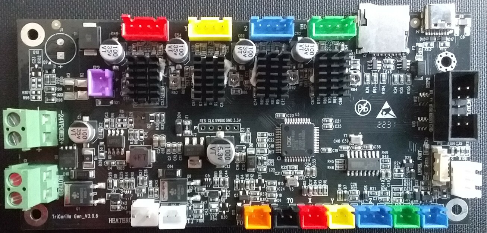
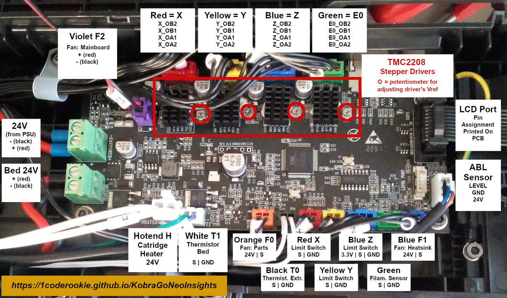
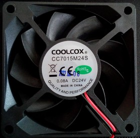

<link rel=”manifest” href=”docs/manifest.webmanifest”>

# Mainboard

## TriGorilla V_3.0.6 (Stock) 
  
The stock mainboard of both the **Go** and the **Neo** is the "TriGorilla V_3.0.6" - it's the same board, it's just flashed with the respective fimware of either model.  

It is a 32bit 24V mainboard with a Huada HC32F460 KCTA ARM Cortex-M4 with 192KB SRAM and 512KB Flash.  
The speed  of the ARM chip is listed as 200MHz by the manufacturer.  
The mainboard comes with TMC2208 silent stepper drivers *soldered* onto the board (they can't be swapped out!).  
It offers a microSD card reader, a USB-C connector and a 10 pin connector for adding the control unit.    
  
  
  
  

!!! danger "Add Ferrules To The 24V Wires!" 

    **It's highly advisable to cut off the soldered tips of the wires without a plug (power supply and heated bed) and add ferrules to them.**  
    
    When you are screwing down the soldered tip inside the clamp, the solder will get cracked a bit and may get deformed a bit as well. When the wire gets warm due to the current and the solder gets softer, the contact may become loose which could lead to malfunction or even cause fire in the last consequence. So it's always a good idea to just use proper ferrules.     
  
!!! danger "Avoid Shortcuts!"  
  
    *Shortcuts coming from the cartridge heater for example can/will damage your mainboard, so be careful to never cause a shortcut somehow!*  
    
    A common misbehaviour is to clean the nozzle with a little brass brush during the print process or while everything is heating up.  
    Also grabbing the heater block to e.g. change the nozzle while everything is heating up and electrical current is flowing is another common mistake.  
    When using pliers to hold the heater block, the tips of the pliers may touch the contacts of the wires at the cartridge heater and you cause a shortcut. As a result you can/will get blown up part at the mainboard, like the melted part "D4" for example as shown in the picture below.     
    
    *So always turn off the whole printer first to avoid a shortcut which will destroy your mainboard!*

!!! warning "Use A USB Power Blocker"  

    When connecting the printer to a computer or a Raspberry Pi, it is highly recommended to use an additional USB power blocker.  
    By doing so, you make sure that neither the computer nor the mainboard will draw power through the USB-C connector from the other device. If you don't do so, it can harm your mainboard as well as your computer.  
    
    As it's an fast and easy solution, you can get a device called "USB power blocker" for a few bucks. Attention: make sure to *not* get a "USB *data* blocker" though, it *has* to be a *power* blocker!  
    This device will then be plugged between the USB connector of the computer and the actual USB-C cable. It still allows data to be transferred, but the 5V line isn't existent. The following pictures show such a device and how it's installed.  

      

      

    However, you don't *have* to spend money on this item, as there are other ways to interrupt the 5V power line. For example, you can cut the 5V wire of your USB cable, you can solder a male and a female USB connector onto a little PCB and avoid making the 5V line connection or you can simply use some electric or Kapton tape and cover the belonging pin at the USB connector of the cable like shown in the following picture.  

      

    Keep in mind though that you have to pay attention that you *only* cover the 5V pin and that you have to make sure that the tape is still in place every time you plug in the cable after you unplugged it.  
    

??? info "Red Glue Across All Connectors"

    When you look at the mainboard, you'll see some red glue spread across all connectors. That's just for securing the connnection. You can get that stuff off by carefully pulling it off. It works better if you warm up that stuff *a little bit* for making it more flexible, a hair dryer is good for that. It then becomes a bit softer and easier to be pulled off. Don't heat it up too much though as it'll become too soft then!  
    You can also use a thin screwdriver to lift up a part of that stuff and then use some tweezers to grab it.    
    
    However, be *very careful* to  
    
    - not harm the mainboard by slipping off with the screwdriver or tweezer!  
    - not overheat the mainboards of parts of it when heating up that red glue!  
    - not rip off the heatsinks of the stepper drivers!  
      This can happen really quick as they're just glued onto the stepper drivers with some thermal paste and the red glue is usually spread across the fins of the heatsinks as well!  
      So *if* you have to pull off that stuff from those connectors of the motor wiring, then *make sure that you press down the heatsink with your finger when trying to pull that stuff off!*  
  
??? tip "Need To Get A New Mainboard?" 
  
    - As both the **Go** and the **Neo** use the same mainboard, you can just get yourself the mainboard for the **Go** if you e.g. own a **Neo** and can't get a mainboard for it (at the time of writing this, Anycubic only offers the mainboard for the **Go** in their shop) or if you find a seller but he charges more for the **Neo** version. You just need to flash the specific firmware for the **Neo** before using the printer. 
  

---

### Mainboard Fan
  
The following picture shows the fan of the mainboard. It's a "Coolcox CC7015M24S" (70x70x15mm, 24V).  

  

---
  
## MOD: Other Mainboards 
It's possible to replace the stock mainboard with a different type of board, like e.g. a board from BigTreeTech (BTT). You just have to pay attention that it uses and provides 24V DC as well, as the PSU and the components like the fans etc. are running on 24V. Depending on the type of the board, you might have to use a different ABL sensor (and most likely a different type of control unit as well though, but I assume you'll run Klipper on it then anyway).  

---

### MOD: BTT SKR Pico
Reddit user [sutabi](https://www.reddit.com/user/sutabi/) uses a BTT SKR Pico in his **Go**. You can find his post about it here: [Anycubic Kobra Go - BTT SKR Pico](https://www.reddit.com/r/anycubic/comments/13xozgu/anycubic_kobra_go_btt_skr_pico/).  
He also offers his `printer.cfg` for the Pico in my [Klipper4KobraGoNeo repository](https://github.com/1coderookie/Klipper4KobraGoNeo) - many thanks for that!  

---

### MOD: BTT Manta M4P + CB1
Reddit user [Jurai_Probs](https://www.reddit.com/user/Jurai_Props/) uses a BTT Manta MP4 + CB1 in his **Go**. You can find his post about it here: [Kobra Go Klipper](https://www.reddit.com/r/anycubic/comments/14zf6m6/kobra_go_klipper/).  

---

   
