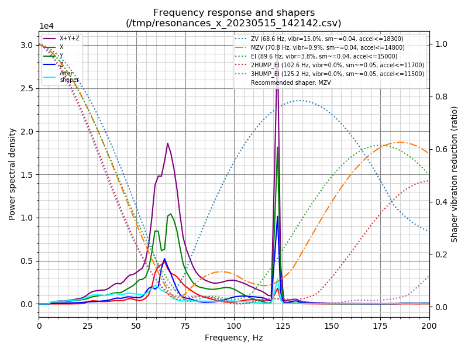
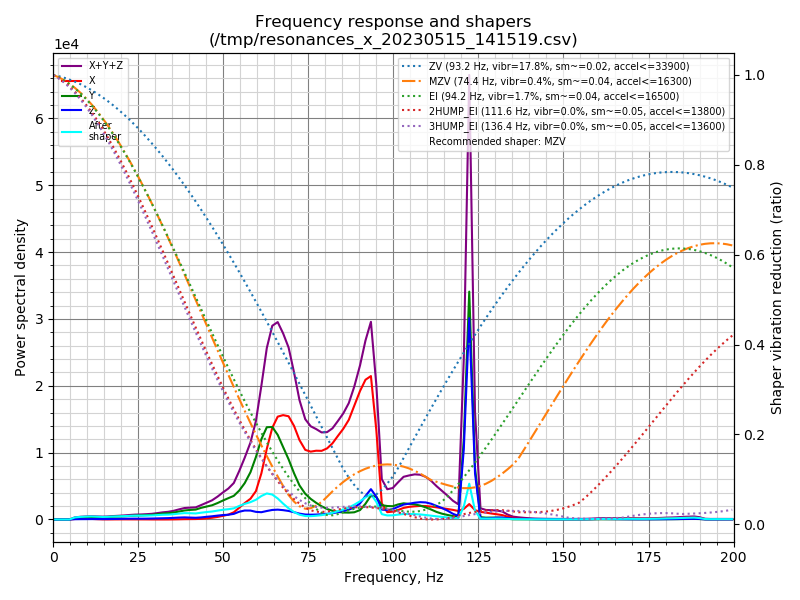

<link rel=”manifest” href=”docs/manifest.webmanifest”>

# Other

Here you can find whatever didn't seem to fit in one of the other chapters.  

---
  
## MicroSD Card
The printers are shipped with a 8GB microSD card. If you need to replace that card with a new one, make sure to format it as FAT32. Cards up to 32GB should work.  
It might happen though that several cards won't be accepted and the error message "SD init fail" will be reported. In that case, try to completely format it again (full format, not fast format) as FAT32. If that still doesn't solve the problem, try a different card. I personally had to try five(!) different cards of different sizes until the printer finally accepted one (actually the oldest 4GB I had laying around).  

---
  
## Spool Holder
The spool holder of both models is mounted to the top frame.  

However, due to the construction of the frame itself, the additional weight being put on top of it, the resulting impact of the (changing) weight on vibrations while printing (especially at higher speeds) and because of the poor roll-off behavior of the spool itself I'd suppose to create a spool holder which isn't attached to the printer itself and which uses ball bearings as well.  

If you don't have the space for it or want to keep the spool being attached at the top of the frame because of other reasons, then at least print a holder which uses ball bearings, so that the spool can turn better while the filament gets pulled off of it. Look around at e.g. Thingiverse, there are many models to find.  

??? tip "Boxed Spool Holder"

    If you'd use a box with a lid which closes really well (best would be this kind of plastic box with the silicone sealing in the lid) and put a bag of desiccant in the box as well, you could also can keep the filament dry and dust-free.  
    Just print yourself one of those ball bearing spool holders where you place the spool onto, drill a hole in the side of the box and feed the filament through. Then place it next to the printer or onto a shelf above it and you're good.  
    Putting one of these cheap digital hygrometers in the box as well helps keeping an eye on the actual humidity inside of the box.  

    I personally used a cakebox with a lid which I mounted to an adjustable construction to the wall (cuz I couldn't get my hands on a decent box and ran across that cheap cakebox, so I couldn't resist). The spool itself is held by a bolt with some ball bearing spool holder.  
    Of course I put a bag of desiccant and a cheap hygrometer in there as well.  
    This solution isn't as air-tight as a box with a silicone sealed lid, but it does the job in my room fine. Plus, it keeps dust and my cats away from the filament as well.  

    

    

    

??? info "Influence Of The Spool Weight On Vibrations"  

    I personally don't like the spool being attached to the top of the frame. Even though I do see the 'value' of it in saving space around the printer, I personally think that adding 1kg (or even 2kg as some people mount a second one on top as well) to this kind of construction isn't the best idea.  
    
    The construction itself isn't the most rigid one anyway, and the higher the x-axis gantry rises along the z-axis, the stronger the vibrations become which are caused by the moving parts. Adding another kilogram or even more to the top now will enhance this effect, which will become even bigger when printing with higher speeds. Plus, the changing weight of the spool (due to the filament being used) causes a changing pattern of these vibrations.  
    
    By using Klipper and the Input Shaper functionality, we can measure the vibrations and apply certain algorithms to compensate them. But due to the fact that the patterns of these vibrations alter with the changing weight of the spool(s), it's kinda counterproductive to mount the spool(s) on top.  
    As I didn't had an empty and a full spool to test the vibrations for investigating this problem, a friend of mine was so kind to run these tests. Even though he uses a Creality Ender3 V2 Neo and not a Kobra Go or Neo, the results are pretty impressive and allow to assume that the behaviour will be somewhat similar due to the same constructions of the printers.  
    
    I don't know *how much* this affects the outcome of the printed model in real life at the end, but as we try to eliminate factors that might have a negative effect anyway, I just wanted to show you this for making you aware of it.  
    
    So the following images show the outcomes of the Input Shaper measurements with an ADXL345 sensor being used. The first two images show the vibrations of the x-axis test with a full 1kg spool and an empty spool, the next two images show the belonging results for the y-axis.  
    
    | X-Axis, Full Spool (1kg) |
    |---|
    |  |  
    
    | X-Axis, Empty Spool |
    |---|
    |  |
    
    | Y-Axis, Full Spool (1kg) |
    |---|
    |  |
    
    | Y-Axis, Empty Spool |
    |---|
    |  |

---
    
## Filament Storage  

Storing your filament in a way that it's not only protected from dust and UV light, but also from moisture is the way to go. As always, you have plenty of options. You could put the used spool back in a bag and vaccum and seal it, use re-usable plastic bags with a zipper and a hole for using a pump to create a vaccum, put all of your spools in a big box which is as much sealed as possible or use individual sealed containers for each spool - just to name a few.  
After doing some tests with different storage solutions and measuring the humidity over time, I personally decided to go with the last option I just mentioned - and after observing the stability of the humidity and the filament, I really can recommend it. So let me go a bit into details about it.  

I got myself some of those sealed cereal containers in the size of 4l (size is about ). The 1kg spools fit in there perfectly (at least the ones I tested - I didn't test the brands with those spools made from cardbox though and therefore I don't know if those may vary in the size), 2kg spools don't fit. These containers come with a sealed lid you can clip on the container.  
I printed a little mount for those cheap rectangular hygrometers and printed a mini spool holder as well, just to keep the spool in place a bit better (this isn't necessary though). I then also bought a big amount of silica gel (desiccant) and put 200g of it into some thin lady socks (I also tested those small packages which come with the spools, but those ones just don't take enough moisture imho). I got the orange version of the silica gel which turns to a dark green when being moist (don't get the stuff that turns blue as that's toxic) as it makes it easier to judge by a quick glance if the desiccant is still good to use.  
Adding some labels to the box helps identifying the different types of filament without the need to open the box and thake out the spool. I didn't type the colour, as I'm able to identify that through the box.  

So, adding that 200g bag into an empty container got the humidity down to 10%. That was stable across time. After adding a fresh spool right out of the sealed bag, the humidity usually raised up to something between ~40-50%, which then dropped down to 10% again over time. This value was stable then over time. In my opinion this method doesn't only keep the humidity inside of the container low but it also dries the filament over time.   

The following picture shows a setup like that.  

You could also drill a hole in the container to feed the filament right out of the box and even add a ball bearing mount for holding the spool. If you don't have any other feeding system, then I'd suggest to modify one of those containers for this purpose. You can also find guides about this solution and find models for printing different mounting solutions. For permanent storage I wouldn't recommend to do this with all of the containers though, as moisture will more likely get inside (even with a little cap for the hole or tube system you'll probably use).    

---

## Printer Enclosure

---
  
## Mods
In the following I'll list mods or STL files I found which could be interesting in general. Keep in mind that they mostly should fit for both printers in general due to the identical design and contruction itself, so (right now) I don't separate them into **Go** and **Neo** like usually.    

- [Gregg Bennett](https://www.printables.com/de/social/221278-greg-bennett) created [risers](https://www.printables.com/de/model/394918-anycubic-kobra-neo-risers) which slip on the feet of the printer to rise up the whole construction allowing a better airflow for the fans of the mainboard and the power supply unit.  
- [Lohtex](https://www.printables.com/de/social/546846-lohtex) created [bed spacers](https://www.printables.com/de/model/376710-anycubic-kobra-go-bed-spacers) which could be used to replace the stock ones if they're completely different in their size.  
  However, keep in mind though that also the bottomside of the bed will get warm and therefore the spacers might become deformed if using PLA, so make sure you're printing them with e.g. ABS. Also keep in mind that prints aren't 100% correct in their dimensions, so that printing spacers won't be the final solution to get your bed perfectly trammed.   
- [Stellar5](https://www.printables.com/de/social/407998-stellar5) created a [purge/drip tray](https://www.printables.com/de/model/351007-anycubic-kobra-go-purgedrip-tray) which can be mounted to the frame and prevents filament from falling underneath the printer while heating up in home position.
- [ZAch Goldberg](https://www.printables.com/de/social/457330-zach-goldberg) created a [sidemount](https://www.printables.com/de/model/334261-anycubic-kobra-go-side-mount) which can be mounted underneath the holder of the control unit and offers some mounting options for e.g. a Raspberry Pi.   
