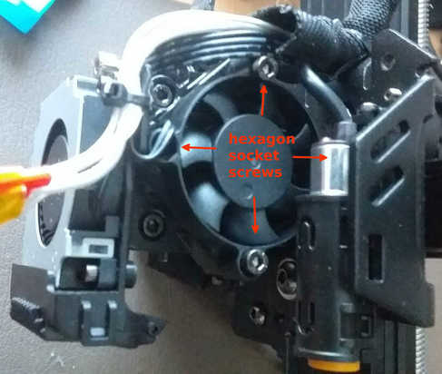

<link rel=”manifest” href=”docs/manifest.webmanifest”>

# Printhead

## ABL sensor
Both printers come with a proximity sensor for automatic bed levelling (ABL).  
  
..img..
  
If you look at the printhead from the front, you'll notice that the one of the **Go** is a bit smaller than the one from the **Neo**. The ABL sensor at the **Go** is mounted pretty much straight behind the heater block, where at the **Neo** it's located a few centimeters to the right side next to the heater block.   
  
## Extruder
The **Go** uses a bowden drive extruder, while the **Neo** is using a direct drive extruder.  
  
..img..
  
If you're about to buy one of either models and you're not sure which fits you better, always go for the direct drive and get yourself the **Neo**.  
  
## Hotend
  
..img..  
  
## Heater Block
Both printers use the E3D V5 compatible heater block.  

..img..

Both the thermistor and the heater cartidge have to be plugged into the specific hole and should be fixed with at tiny screw (T 1.5). Make sure that you don't tighten the screw too much as it could harm both the thermistor and the heater cartridge. 

## Nozzle
Anycubic ships the printheads with a 0.4mm brass nozzle for 1.75mm filament. 

..img..

The nozzle is compatible with e.g. E3D V6 nozzles.  
  
Do yourself a favour and don't buy those cheap brass nozzles where you'll get a dozen of them for a few bucks. It's just not worth it.  
Remember that the nozzle is pretty much the most crucial part when it comes down to printing and achieving good results, as it's the last link in the chain of the print process and puts out the filament.  
So go for a manufacturer who is known for quality nozzles.  
  
I personally use the E3D V6 brass nozzles for printing PLA+. Yes, they are a bit more expensive than the super cheap ones, but it's worth it - they last longer, they're precisely made and you'll get much better results. As long as you don't want to print special abrasive filaments, you're always good with these E3D V6 brass nozzles.  
  
If you want to print filaments that are more abrasive, you probably want to go nozzles made from plated copper, stainless or hardened steel, ruby sapphire nozzles and so on.  

## Silicone Sock
The silicone sock isolates the heater block. Therefore it should stay in place and shouldn't come aoff, as it cause the "thermal runaway" error.  
The sock which comes with the printhead isn't the best one to use (in my opinion), as it comes off pretty easily. There are compatible socks at the aftermarket which I personally use and which I can highly recommend. They have a bigger lip which slips over the heater block and covers a bigger area of the top than the one which comes with the printer. Therefore they stay in place much better when they heat up and become more flexible.  
The following pictures show the compatible one from the aftermarket on the left side and the stock sock on the right side.     
  
   
  
Additionaly, they also cover the base of the nozzle - something that the stock ones don't do at all.  
  
  
  
  
## Disassambling the Heater Block / Hotend / Nozzle
  
### Changing the Nozzle
If you just want to change the nozzle, take off the silicone sock, then heat up the extruder first and pull back the filament a bit once it's warm enough. Once the extruder heated up, *turn off the printer* and unplug it from the power outlet! Then grab the heater block with a plier to hold it in place and screw out the nozzle.  
  
| Attention |
|:----------|
| *Be careful to NOT touch and harm the wires and contacts of the thermistor and the heating cartridge with your pliers!* You may either harm the insulation, break the wire or even cause a shortcut which can result in a broken mainboard once you powered the printer up again. So make sure you really just grab the heater block, preferably grab it from the side where the wires don't come out. |
| *Make sure you DON'T turn the heater block!* You don't want to loosen the heater block from the hotend, so just hold it in place. |
  
### Taking out the Extruder  
If you want to change the whole extruder, the hotend or the heater block, you have to take the extruder out first. Therefore take off the plastic cover of the print head. 

#### Kobra Neo
In the following, the further steps of this procedure are described for the Kobra **Neo**.  
After the plastic cover is gone, you can see the vents, the proximity sensor at the right side and the heater block at the bottom. You now have to disassamble the vent on the right side by taking out the four hexagon socket screws.   
  
  
  
Then you'll see two hexagon socket screws at the side, which are holding the hotend - loosen them until you can pull out the extruder.  
  
  
  
For reassambling, just put everything back together. Make sure you push the hotend far enough in the specific hole - I personally push it as far into it as it goes. Turn the extruder so that the wires which are coming from the heater block are hanging freely. Then tighten up the screws, so that the extruder doesn't turn or wiggle anymore (but don't overtighten the screws though). Reassamble the vent an the plastic cover.   
  
## Mods
