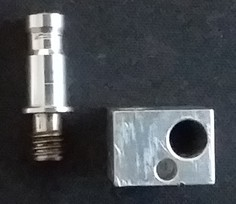
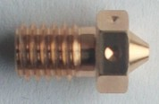
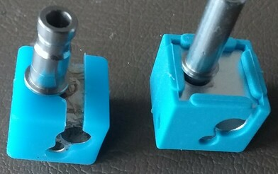
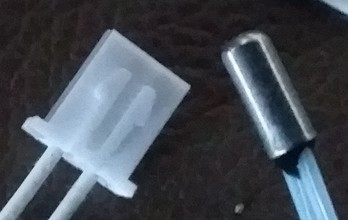
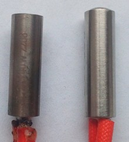
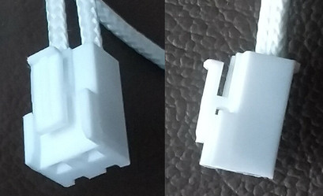

<link rel=”manifest” href=”docs/manifest.webmanifest”>

# Printhead
The printheads of the **Go** and the **Neo** aren't identical because of the different type of extruder they're using: the **Go** uses a bowden extruder while the **Neo** is using a direct drive extruder. If you look at both printheads from the front and compare their size, you'll notice that the one of the **Go** is a bit smaller and more suqare than the wider and more square one from the **Neo**.  
  
## Go
!!! question Got a **Go**?  
    Do you own a Kobra **Go** and want to contribute? That would be great!   I'd need pictures of the printhead like the ones I show here of the **Neo** for example, so people can see the difference between those two models like the shape and the position of the ABL sensor.   Just send me an email to   `3dneo (at) quantentunnel.de`   Thank you!  
  
## Neo  
The following picture shows a new printhead for the **Neo** as it comes as a spare part.  
  

The following picture shows a close up view of the printhead of the **Neo** from the front view. At the bottom you can see the blue silicone sock of the heater block with the nozzle in the middle and the orange tip of the ABL sensor at the right side.  
  
 
  
---

## ABL Sensor
Both printers come with a proximity sensor for automatic bed levelling (ABL).  
The ABL sensor at the **Go** is mounted pretty much straight behind the heater block, where at the **Neo** it's located a few centimeters to the right side next to the heater block. The following picture shows the location of the ABL sensor at the printhead of the **Neo**, looking at it from a bottom view angle - the ABL sensor is the part at the right side with the round orange tip.   
  

  
!!! tip  
    Measure the original position (depth/height) of the sensor as it came with and write it down. In case you have to change the sensor or even you loosened the screw which holds it in place by accident you can always put it back in the original position, so that you don't have to deal with fiddling around to find the best position for it afterwards.   
  
---  
  
## Extruder
The **Go** uses a bowden drive extruder, while the **Neo** is using a direct drive extruder.  
  
If you're about to buy one of either models and you're not sure which fits you better, always go for the direct drive and get yourself the **Neo**.  
  
---  
  
## Hotend
  
### Go
  
!!! question Got a **Go**?
    Do you own a Kobra **Go** and want to contribute? That would be great!   I'd need pictures of the hotend like the ones I show here of the **Neo** for example, so people can see the difference between those two models.   Just send me an email to   `3dneo (at) quantentunnel.de`   Thank you!  
  
### Neo  
  
The hotend of the **Neo** is shown in the following picture. Note the shape of it as it's plugged into the belonging hole at the printhead and secured by two screws. The outer diameter is 6mm(?), the inner diameter is 4mm and the total length is probably something around 2.4-2.5cm (sorry, I forgot to measure it as I had it disassambled). 
  
  
  
Additionally there is a little PTFE-tube inside of it, which is about 4cm long and 4mm thick with a 2mm hole inside of it to guide the 1.75mm filament.  
  
    
  
  
---  
  
## Heater Block
Both printers use an E3D V5 compatible heater block (afaik).  
Both the thermistor and the heater cartidge have to be plugged into the specific holes and should be fixed with at tiny hexagon socket screw (HEX 1.5).  
  
  
    
  
  
---  
  
## Nozzle
Anycubic ships the printheads with a 0.4mm brass nozzle for 1.75mm filament.  
The nozzle is compatible with e.g. E3D V5/V6 nozzles as shown in the following picture.  
  
  
    
### Changing the Nozzle
If you just want to change the nozzle, take off the silicone sock of the heater block, then heat up the extruder first and pull back the filament a bit once it's warm enough. Once the extruder heated up, *turn off the printer* and unplug it from the power outlet! Then grab the heater block with a plier to hold it in place and screw out the nozzle.  
  
For inserting the new nozzle, screw it in and turn it back about half a rotation once you feel it hits the hotend. Then heat up the extruder again and tighten up the nozzle.  
Don't get irritated by the fact that there's a little gap between the head of the nozzle and the heater block - that's totally fine and it's supposed to be like that as the following picture shows.  
  
    
  
  
!!! warning  
    *Be careful to NOT touch and harm the wires and contacts of the thermistor and the heating cartridge with your pliers!* You may either harm the insulation, break the wire or even cause a shortcut which can result in a broken mainboard once you powered the printer up again. So make sure you really just grab the heater block, preferably grab it from the side where the wires don't come out.    
    *Make sure you DON'T turn the heater block!* You don't want to loosen the heater block from the hotend, so just hold it in place.     
      
   
### Tips  
When it comes down to choose the right nozzle size, it all depends on what you want to print and how detailed it should be. The standard size of 0.4mm the printers come with is a good starting point. But you may find yourself in the situation that you want to print more detailed objects or objects which should be more sturdy or where it doesn't matter if the surface doesn't look as clean and flat as possible, so you probably should adjust the size and switch to a smaller oder bigger diameter like 0.2-0.3mm for detailed objects and 0.6mm for the 'rougher' prints. Keep in mind though that the printing time increases by choosing a smaller diameter and it decreases when you are using a bigger diameter. Search the web for more specific informations about finding and choosing the right nozzle size for your project.  
  
In case you're using *Cura* as a slicer, make sure you update to the current version v5.x (Note: It doesn't run at Ubuntu versions below 20.x though) as it uses the new Arachne engine and offers better quality as a result of that. In case you never heard of that, I recommend to watch the following videos from [Thomas Sanladerer](https://www.youtube.com/channel/UCb8Rde3uRL1ohROUVg46h1A) or read the articles at his page [https://toms3d.org/](https://toms3d.org/) where he shows the result of using a 0.6mm nozzle with Cura v5.x comparing to a 0.4 nozzle using Cura 4.x (spoiler: you barely can see a difference).  
  
- [Video: 0.4mm nozzles just became obsolete](https://www.youtube.com/watch?v=WgXM2zPusXo)  
  [Article: 0.4mm nozzles just became obsolete](https://toms3d.org/2022/07/28/arachne-in-prusaslicer-0-4mm-nozzles-just-became-obsolete/)  
- [Video: Get the benefits of a 0.6mm nozzle with a 0.4?](https://www.youtube.com/watch?v=nmigF5qyJ4M)  
  [Article: Get the benefits of a 0.6mm nozzle with a 0.4?](https://toms3d.org/2022/09/22/get-the-benefits-of-a-0-6mm-nozzle-with-a-0-4/)  
  
Do yourself a favour and don't buy those cheap brass nozzles where you'll get a dozen of them for a few bucks. It's just not worth it.  
Remember that the nozzle is pretty much the most crucial part when it comes down to printing and achieving good results, as it's the last link in the chain of the print process and puts out the filament - so go for a manufacturer who is known for quality nozzles.  
  
I personally use the E3D V6 brass nozzles for printing PLA+. Yes, they are a bit more expensive than the super cheap ones, but it's worth it - they last longer, they're precisely made and you'll get much better results. As long as you don't want to print special abrasive filaments, you're always good with these E3D V6 brass nozzles.  
  
If you want to print filaments that are more abrasive, you probably want to go with nozzles made from plated copper, stainless or hardened steel, ruby sapphire nozzles and so on. Check out the web for further and more specific informations about what to choose.  
  
---   
  
## Silicone Sock
The silicone sock isolates the heater block. Therefore it should stay in place and shouldn't come aoff, as it cause the "thermal runaway" error.  
The sock which comes with the printhead isn't the best one to use (in my opinion), as it comes off pretty easily. There are compatible socks at the aftermarket which I personally use and which I can highly recommend. They have a bigger lip which slips over the heater block and covers a bigger area of the top than the one which comes with the printer. Therefore they stay in place much better when they heat up and become more flexible.  
The following pictures show the compatible one from the aftermarket on the left side and the stock sock on the right side.     
  
   
  
Additionaly, they also cover the base of the nozzle - something that the stock ones don't do at all.  
  
  
  
---  
  
## Thermistor & Cartridge Heater
The *thermistor* which is used is a capsuled NTC 100k (probably "3950"). The diameter is 3mm, the length should be minimum 6mm as that is the depth of the hole in the heater block. You should be able to use a compatible item from the aftermarket which fits a V5/V6 heater block, e.g. an ATC Semitec 104GT-2. The following picture shows the thermistor from the aftermarket I used and the specific plug, the wire is about 150cm long.  
  
  
  
The *cartidge heater* which is used is a 24V 40W element. The diameter is 6mm, the length of the original part is about 18mm. However, a cartridge heater from the aftermarket with a length of about 21mm is just fine, it just sticks out at both sides of ther heater block at the end which shouldn't be a problem. It seems that it's is a typical dimension for V5/V6 heater blocks. The following picture shows the original part on the left side and a compatbile part from the aftermarket I used at the right side.  
  
  
  
The wire is about 150cm with the specific plug at the end shown at the following picture.  

  
### Tip
If you need to install a new thermistor and/or cartridge heater, you have to unstrip the wires from the cable conduit. You can just unroll the conduit, pull out the wires from the old part while tugging in the wires of the new part. Be careful to not pull too hard to not harm any thin wires which might be wrapped around the wires of the old part.  
  
  
  
!!! warning  
    *Make sure you don't tighten the screws too much as it could harm both the thermistor and the heater cartridge!* Note the dent from the screw and the deformed thermistor due to an overtightened screw from the manufacturer at my **Neo** at the following picture.  
  
|    
  
When installing the parts at the heater block and putting back on the plastic cap of the printhead, I personally avoided to bend the thin wires as it was done within the original installation. I just guided the wires along outside the plastic cover. By doing so, you minimize the risk of getting a shortcut due to a harmed or melted wire isolation at the part where the wires are bended and twisted originally. The following picture shows my new installed thermistor and cartridge heater with the wires running outside of the plastic cap.  
  
  
  
!!! tip 
    *After successful installation of the new thermistor and/or cartridge heater, execute a PID calibration using e.g. Octoprint.*  
  
---  
  
## Disassambling the Printhead
  
If you need to disassamble the printhead for e.g. changing the hotend, you need to unload the filament first. Then take off the plastic cover: unscrew the hexagon socket screws at the back and release the plastic clip at each side - be careful not to break them.   
  
### Go
  
!!! question Got a **Go**?  
    Do you own a Kobra **Go** and want to contribute? That would be great!   I'd need pictures of disassambling the printhead like the ones I show here of the **Neo** for example, so people can see the difference between those two models.   Just send me an email to   `3dneo (at) quantentunnel.de`   Thank you!  
  
  
### Neo  
  
If you want to change the whole extruder, the hotend or the heater block, you have to remove the fan at the right side as the screws which are holding the hotend in place are underneath it. So after the plastic cover is gone, you can see the vents, the proximity sensor at the right side and the heater block at the bottom. You now have to disassamble the vent on the right side by taking out the four hexagon socket screws.   
  
  
  
Then you'll see two hexagon socket screws at the side, which are holding the hotend - loosen them until you can pull out the extruder.  
  
  
  
Make sure the PTFE tube of the hotend comes out, too. Inspect it if it isn't clogged - if so, either clean it up by e.g. using a little drill or just get a new one as a replacement.   
  
When taking out the extruder, *be careful to not break any wires or rip them off from the sensor and heater catridge* - so unscrew the tiny hex screws and take out the thermistor and the heating cartridge. Check the wires and contacts if they aren't harmed and if everything is ok. *If you can see bare wire shining through the isolation, replace the component to not risk a shortcut and therefore a broken mainboard.*   
  
If you want to change the hotend or the heater block now, take out the PTFE tube. Then heat up the metal parts by using a heat gun for example and unscrew the hotend from the heater block. Make sure to neither harm the metal parts by the pliers nor yourself by the hot material.  
    
For reassambling, just put everything back together:  
  
1. Warm up the parts and screw the hotend into the heater block until it sits tight.  
2. Put back the cleaned or renewed PTFE tube.  
3. Put the thermistor and the heater cartridge back in place and secure them by *carefully* tighten the tiny hex screw - *don't overtighten them as you could harm the thermistor and the heater cartridge!*  
4. Then push the hotend back into the specific hole - make sure you push it deep enough (I personally push it as far into it as it goes).  
5. Turn the extruder so that the wires which are coming from the heater block are hanging freely and aren't bent too much.  
6. Then tighten up the screws, so that the extruder doesn't turn or wiggle anymore (but don't overtighten the screws though).  
7. Reassamble the vent and the plastic cover.   
  
---  
  
## Mods

### Go  
  
- Reddit member [xpeng121](https://www.reddit.com/user/xpeng121/) posted his modification for the Kobra **Go** to a direct drive extruder: [Kobra Go direct drive mod. Yes it's Neo now...](https://www.reddit.com/r/anycubic/comments/10howol/kobra_go_direct_drive_mod_yes_its_neo_now/)  
  
### Neo  
  
