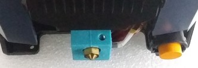
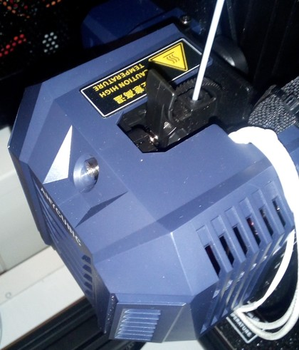
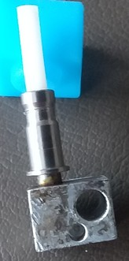
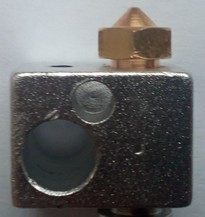
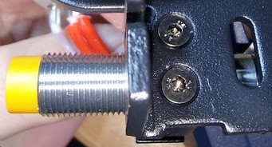
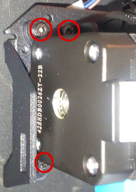
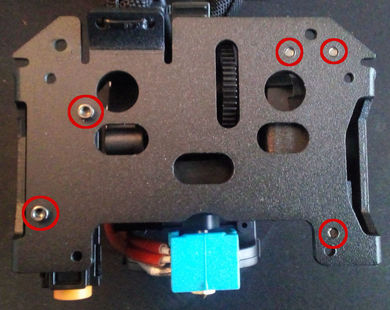
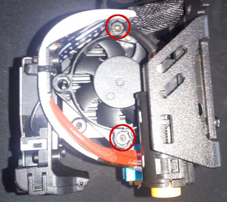
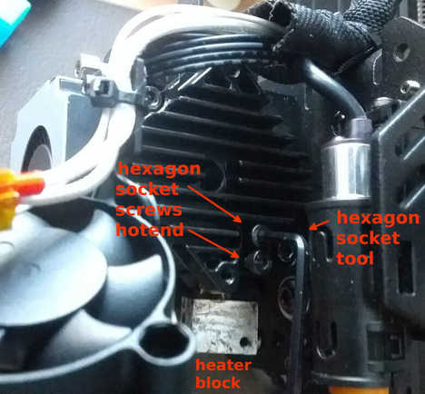

<link rel=”manifest” href=”docs/manifest.webmanifest”>

# Printhead
The printheads of the **Go** and the **Neo** aren't identical because of the different type of extruder they're using:  

- the **Go** uses a bowden drive feeder/extruder while 
- the **Neo** is using a direct drive feeder/extruder.   
  
If you look at both printheads from the front and compare their size, you'll notice that the one of the **Go** is a bit smaller and more suqare than the wider and more rectangular shaped one of the **Neo**.  
  
## Go
The following picture shows a new printhead for the **Go** as it comes as a spare part.  
  

The following picture shows a close up view of the printhead of the **Go** from the front view. At the bottom you can see the nozzle in the center and the orange tip of the ABL sensor at the left side.  
  
    
  
## Neo  
The following picture shows a new printhead for the **Neo** as it comes as a spare part.  
  

The following picture shows a close up view of the printhead of the **Neo** from the front view. At the bottom you can see the blue silicone sock of the heater block with the nozzle in the center and the orange tip of the ABL sensor at the right side.  
  
 
  
---

## ABL Sensor
Both printers come with a proximity sensor for automatic bed levelling (ABL) which is (afaik) the same model.  
The ABL sensor at the **Go** is mounted pretty much straight behind the heater block, where at the **Neo** it's located a few centimeters to the right side next to the heater block.  
  
??? tip "Sensor Position"  

    Most of the time users have to adjust the postion of the ABL sensor even when the printer is brandnew and came straight from the factory. Scroll further down below to the "Disassemble" section where I described the procedure to level it.   
  
### Go
The following picture shows the location of the ABL sensor at the printhead of the **Go**, looking at it from a bottom view angle - the ABL sensor is the part at the left side with the round orange tip.   
  

    
The ABL sensor itself is mounted in a plastic bracket which is the mounted to the metal backplate. You can adjust the height of the position by loosening the screw at the left side of the clamp which then allows you to move the sensor.  
  

  
### Neo
The following picture shows the location of the ABL sensor at the printhead of the **Neo**, looking at it from a bottom view angle - the ABL sensor is the part at the right side with the round orange tip.   
  

    
The ABL sensor itself is mounted in a plastic bracket which is the mounted to the metal backplate. You can adjust the height of the position by a little spring supported screw located at the top.  
  

    
---  
  
## Extruder / Feeder
The **Go** uses a bowden drive extruder/feeder, while the **Neo** is using a direct drive extruder/feeder.  
If you're about to buy one of either models and you're not sure which fits you better, always go for the direct drive and get yourself the **Neo**.
  
---
  
### Go
  
??? question "Got a **Go**?"  

    Do you own a Kobra **Go** and want to contribute? That would be great!   I'd need a picture of the bowden drive feeder, so people could see the difference between the **Go** and the **Neo**.   Just send me an email to   `3dneo (at) quantentunnel.de`   Thank you! 
  
---  
  
### Neo
The following picture shows the extruder/feeder of the **Neo** with the mounted plastic cover of the printhead.  
  

  
At the top in front of the little hole where the filament is inserted you find a little lever for manual release of the tension while loading/unloading the filament. The screw in the front adjusts the pressure of the feeder gear which is brought onto the filament. The following picture shows the mechanism without the plastic cover.  
  

  
!!! warning

    Make sure that you set the retraction distance and speed to the correct values for a direct drive! In general, it's supposed to be something around 1mm distance and probabyl around 50mm speed. If you set the distance to a value which is too high (e.g. the default 6mm for the **Go** as a bowden drive), the melted filament might be pulled back too far and reaches the PTFE tube which might get clogged then. 
  
??? tip "Feeder Gear Pressure"

    When adjusting the pressure of the feeder gear, make sure you don't tighten it up too much as it could squeeze and deform the filament. On the other hand it shouldn't be too loose though as it should transport the filament reliably. If you hold the filament with two fingers applying just a little amount of pressure and the feeder still pulls it out of your fingers, then you should be good. You might want to try different settings of the tension though.    
  
---  
  
## Hotend & Heatbreak
  
### Go
  
The hotend of the **Go** is shown in the next pictures. In the second picture you can see the heatbreak screwn into the block but dismounted from the aluminum cooling element.  

  
  

  
---  
  
### Neo  
  
The hotend of the **Neo** is shown in the following picture. Note the shape of the heatbreak as it's plugged into the belonging hole at the printhead and secured by two screws. The outer diameter of the heatbreak is 6mm(?), the inner diameter is 4mm and the total length is probably something around 2.4-2.5cm (sorry, I forgot to measure it as I had it disassembled, will do it next time though). 
  
  
  
Additionally there is a little PTFE-tube inside of it, which is about 4cm long and 4mm thick with a 2mm hole inside of it to guide the 1.75mm filament.  
  
    
  
!!! warning

    - Too high temperatures may harm the PTFE tube - it may become deformed!   
    - If you dismounted the hotend and you put it back into the printhead, make sure you check and adjust the position of the ABL sensor and your Z offset afterwards!  
    - If you replaced your old hotend with a new one (regardless of whether you also replaced the thermistor and/or cartridge heater with a new one or keep using the existing ones), execute a PID tuning afterwards!
  
??? tip "Can't Load New Filament?!"

    If you can't load new filament even though nothing seems to be sticking in there anymore, it's most likely that the little PTFE tube inside of the hotend is clogged. To clean or replace it you need to disassemble the hotend from the printhead. Scroll down to the "Disassembling" section to find a little guide about how to do that.   
  
??? tip "Spare Part Hotend"

    - If you need a new hotend because your heater block or the heatbreak needs to be changed, you can get yourself the spare part hotend for the regular *Kobra*. If you look at the picture of it and compare it with the ones I've shown above, you'll notice that the shape of the heatbreak is the same. So up to me it'll fit perfectly.   
    - If the old thermistor and/or cartridge heater are still good and the wires aren't harmed, you don't have to fiddle around to use the new ones! Just take the existing ones out of the old heater block and install them in the new one.   
    - Besides that, the hotend for the *Kobra* comes with a cartridge heater and a thermistor which are also compatible with the ones from the **Go** and **Neo** - at least from a technical side of view. So you'd have them as a spare part also.   However, the wires of these parts are way too short though, so you wont't be able to connect them directly! So in case you have to use them, you probably could either just cut the plug and the old part and solder the wires together or (if you have the tools for that) crimp the specific socket for the plug to the old wire to just connect them this way. Polarity doesn't seem to matter here, so just connect the wires.  
    - *Remember to execute a PID tuning after changing the thermistor and/or the cartridge heater!*  
    - However, scroll down and check out the "Disassembling" section below to see how to dis- and reassemble it. *Maybe you don't need new parts, so try to clean up everything first and reassemble it before ordering new parts right away.*
  
---  
  
## Heater Block
Both printers use an E3D **V5** compatible heater block.  
Both the thermistor and the cartidge heater have to be plugged into the specific holes and should be fixed with at tiny grub screw (HEX 1.5).  
  
  
  
!!! warning  

    If you need to replace the thermistor and/or the cartridge heater, *make sure you don't overtighten the screws as it could harm both the thermistor and the heater cartridge!* Note the dent from the screw and the deformed thermistor due to an overtightened screw from the manufacturer at my **Neo**.     
      

---   
  
## Silicone Sock
The silicone sock isolates the heater block. Therefore it should stay in place and shouldn't come off, as it may cause the "thermal runaway" error.  
The sock which comes with the printhead isn't the best one to use (in my opinion) as it seems to come off pretty easily. There are compatible V5 silicone socks at the aftermarket which I personally use and which I can highly recommend. They have a bigger lip which slips over the heater block and covers a bigger area of the top than the one which comes with the printer. Therefore they stay in place much better when they heat up and become more flexible.  
The following pictures show the compatible one from the aftermarket on the left side and the stock sock on the right side.     
  
   
  
Additionaly, they also cover and therefore isolate the base of the nozzle - something that the stock ones don't do at all.  
  
  
  
??? tip

    If you read the above and still don't know what you should look or search for, search for "silicone sock V5" for example as these socks are for a V5 heater block. You can get them pretty much everywhere, so if you use to shop at Amazon or ebay for example, you'll find many offers which are pretty much the same at the end.   Just make sure that you're **not** getting the ones for a V6 heater block! You can also diffenrentiate them by already looking at the shape: the wrong ones for the V6 are more flat on one side, the *correct ones* for the V5 *are cubic*, so they are shaped like a dice* as you can see at the pictures above.  
  
---  
  
## Thermistor & Cartridge Heater
The *thermistor* which is used is a capsuled NTC 100k (probably "3950"). The diameter is 3mm, the length should be minimum 6mm as that is the depth of the hole in the heater block and the length of the wire is about 150cm.  
You should be able to use a compatible item from the aftermarket which fits a V5/V6 heater block, e.g. an ATC Semitec 104GT-2.  
The following picture shows the thermistor from the aftermarket I used and the specific plug which is necessary to fit in the belonging socket at the mainboard.  
  
  
  
The *cartidge heater* which is used is a 24V 40W element. The diameter is 6mm, the length of the original part is about 18mm, the length of the wire is about 150cm.  
However, a cartridge heater from the aftermarket with a length of about 21mm is just fine, it just sticks out at both sides of the heater block at the end which shouldn't be a problem. It seems that it's is a typical dimension for V5/V6 heater blocks. The following picture shows the original part on the left side and a compatbile part from the aftermarket I used at the right side.  
  
  
  
The following picture shows the specific plug which is necessary to fit into the socket at the maiboard.  

  

!!! warning  

    If you need to replace the thermistor and/or the cartridge heater, *make sure you don't overtighten the screws as it could harm both the thermistor and the heater cartridge!* Note the dent from the screw and the deformed thermistor due to an overtightened screw from the manufacturer at my **Neo**.       
   
??? tip "General Tips" 

    - If you need to install a new thermistor and/or cartridge heater, you have to unstrip the wires from the cable conduit. You can just unroll the conduit, pull out the wires from the old part while tugging in the wires of the new part. Be careful to not pull too hard to not harm any thin wires which might be wrapped around the wires of the old part.       
  
    - When installing the parts at the heater block and putting back on the plastic cap of the printhead, I personally avoided to bend the thin wires as it was done within the original installation. I just guided the wires along outside the plastic cover. By doing so, you minimize the risk of getting a shortcut due to a harmed or melted wire isolation at the part where the wires are bent and twisted originally. The following picture shows my new installed thermistor and cartridge heater with the wires running outside of the plastic cap.     

??? tip "Execute PID Tuning"      
    
    After successful installation of the new thermistor and/or cartridge heater, execute a PID tuning using e.g. Octoprint!  
  
---  
  
## Nozzle
Anycubic ships the printheads with a 0.4mm brass nozzle for 1.75mm filament.  
The nozzle is compatible with e.g. E3D V5/V6 nozzles as shown in the following picture.  
  
  

    
!!! warning  

    - *Be careful to NOT touch and harm the wires and contacts of the thermistor and the heating cartridge with at brass brush or the wrench!*   You may either harm the insulation, break the wire or even cause a shortcut which can result in a broken mainboard once you powered the printer up again. 
    - If you want to change the nozzle (*check out the expandable admonition below!*) and need to grab the heater block with a wrench, make sure you really just grab the heater block and never get any wires up in between - preferably grab the heater block from that sides where the wires don't come out.   
    - If you want to clean the nozzle using a brass brush for example, *never* do it when the printer is powered up and the heating process of the extruder is in progress to avoid causing a shortcut by touching the contacs with the brush.  
    - *Make sure you DON'T turn the heater block!* In case you want to change the nozzle, you don't want to loosen the heater block from the hotend, so just hold the heater block in place without turning it.     
    
??? info "About Nozzles in General" 

    - When it comes down to choose the right nozzle size, it all depends on what you want to print and how detailed it should be. The standard size of 0.4mm the printers come with is a good starting point.   However, you may find yourself in the situation that you want to print more detailed objects or objects which should be more sturdy or where it doesn't matter if the surface doesn't look as clean and flat as possible, so you probably should adjust the size and switch to a smaller oder bigger diameter like 0.2-0.3mm for detailed objects and 0.6mm for the 'rougher' prints.   Keep in mind though that the printing time usually increases by choosing a smaller diameter and it decreases when you're using a bigger diameter due to the smaller/larger layer height that is possible to print.   Search the web for more specific informations about finding and choosing the right nozzle size for your project. You may want to start with this Article from [All3DP: The Best 3D Printer Nozzle Types, Sizes & Materials](https://www.all3dp.com/2/3d-printer-nozzle-size-material-what-to-know-which-to-buy). 
  
    - In case you're using *Cura* as a slicer, make sure you update to the current version v5.x (Note: It doesn't run at Ubuntu versions below 20.x though) as it uses the new Arachne engine and offers better quality as a result of that. In case you never heard of that, I recommend to watch the following videos from [Thomas Sanladerer](https://www.youtube.com/channel/UCb8Rde3uRL1ohROUVg46h1A) or read the articles at his page [https://toms3d.org/](https://toms3d.org/) where he shows the result of using a 0.6mm nozzle with Cura v5.x comparing to a 0.4 nozzle using Cura 4.x (SPOILER: you barely can see a difference).  
  
        - [Video: 0.4mm nozzles just became obsolete](https://www.youtube.com/watch?v=WgXM2zPusXo)  
          [Article: 0.4mm nozzles just became obsolete](https://toms3d.org/2022/07/28/arachne-in-prusaslicer-0-4mm-nozzles-just-became-obsolete/)  
        - [Video: Get the benefits of a 0.6mm nozzle with a 0.4?](https://www.youtube.com/watch?v=nmigF5qyJ4M)  
          [Article: Get the benefits of a 0.6mm nozzle with a 0.4?](https://toms3d.org/2022/09/22/get-the-benefits-of-a-0-6mm-nozzle-with-a-0-4/)  
  
    - Do yourself a favour and don't buy those cheap brass nozzles where you'll get a dozen of them for a few bucks. It's just not worth it.  
    Remember that the nozzle is pretty much the most crucial part when it comes down to printing and achieving good results, as it's the last link in the chain of the print process and puts out the filament - so go for a manufacturer who is known for quality nozzles.  
  
    - I personally use the E3D V6 brass nozzles (0.6 mm right now) for printing PLA+. Yes, they are a bit more expensive than the super cheap ones, but it's still a good price and it's really worth it - they last longer, they're precisely made and you'll get much better results. As long as you don't want to print special abrasive filaments, you're always good with these standard E3D V6 brass nozzles.  
  
    - If you want to print filaments that are more abrasive, you probably want to go with nozzles made from plated copper, stainless or hardened steel, ruby sapphire nozzles and so on. Check out the web for further and more specific informations about what to choose.      

### Cleaning the Nozzle
If you need to clean the nozzle during the printing procedure to take off excessive amount of melted filament or if the nozzle is clogged, mind the warnings from above and check out the following steps in the expandable block below.  
  
However, keep in mind that nozzles are consumables though, they won't last forever. So get yourself some good quality nozzles right away so that you can easily replace a nozzle which is too clogged or where the tip may already be harmed.  
A harmed tip may also cause artefacts like stringing for example, so also keep that in mind if you suddenly see yourself confronted with weird and unexplainable printing behavior (in terms of quality).  
  
??? example "Cleaning the Nozzle"

    - For cleaning the nozzle and getting rid of excessive filament during the printing process or right before printing starts as the extruder is heating up, just use a long and thin wooden stick like a skewer. A wooden toothpick also works fine - just make sure you don't burn yourself as it may be a bit short.  
    - Before and after each print I recommend to wipe away the melted filament at the nozzle with a paper towel or a cloth - but *don't burn yourself!* This procedure keeps the nozzle clean and the rest of the filament won't burn black onto the brass which makes it hard to remove later.   
    - If the nozzle is already too smeared and has too much filament burnt onto the surface to be cleaned with a paper towel, you can use a small brass brush. Be careful though to not harm the tip of the nozzle by scrubbing too hard across it! Be careful to *not* touch any wires or contacts during brushing at it may cause a shortcut and blow off your mainboard! So I'd suggest you heat up the nozzle and then turn off the printer before starting to brush.  
    - If the nozzle is clogged, using a needle with the correct diameter to stick it into the hot nozzle for cleaning it sometimes works. Just stick in in the heatened up nozzle and poke around. Be careful to not harm the tip of the nozzle though!  
    - You can also use certain filament which is made for cleaning. You load it and let it run through. 
    - If the nozzle is clogged and therefore the cleaning filament can't run through, you could also try to do a "cold pull". To do so you load the cleaning filament and manually push it into a bit. Then let the nozzle cool down and rip out the filament. You may have to repeat this procedure a few times until the cleaning filament can run through again. However, be careful not to rip off the filament by doing the cold pull as you then definitely have to disassemble the hotend. 
    - If you still encounter problems with the flow of the filament though or if you even can't load new filament, most likely the little PTFE tube inside of the heatbreak is clogged. Scroll down to the "Disassembling" section where you'll find a little guide about how to get it out and clean it.  
    - If you took out the nozzle from the heater block and can't get it clean, try to put in acetone and let it sit there - the longer the better (I'd say minimum 24hrs). This method works especially great with ABS as that just dissolves, but it also works at least a bit with other types of filament like PLA (although not as good as with ABS at all) and makes it a bit softer. Then you can try to poke the filament out. This also works with the heater block and the heatbreak if you want to clean them also. Make sure to rinse them with water before installing though.  

     
### Changing the Nozzle
If you need to change the nozzle, mind the warnings from above and check out the following steps in the expandable block below.
     
??? example "Changing the Nozzle"  

    - If you just want to change the nozzle, take off the silicone sock of the heater block, then *heat up the extruder first* about 5-10°C above your regular printing temperature and pull back the filament a bit once it's warm enough. 
    - Once the extruder heated up, let it sit at that temperature for about a minute or two to make sure that even the last amount of filament which might stick somewhere in the gaps or the thread is melted. 
    - Then *turn off the printer* and ideally unplug it from the power outlet. Don't fiddle around while it's turned on - in case you slip with the wrench and harm the wires you could create a shortcut which most likely will blow something up of your mainboard.  
    - Then grab the heater block with a wrench to hold it in place and screw out the nozzle carefully. Use a sufficient tool like a wrench or a socket wrench for the nozzle - don't use a pair of pliers as it may/will round off the screw nut. 
    - Make sure you don't turn the heater block at all to not loosen it from the heat break! Just hold it in place.
    - If the nozzle won't come loose, heat up the extruder again, raise the temperature a bit and let it sit longer to melt the filament in the gaps which seems to block. Before trying to unscrew the nozzle, switch off the printer again.   If that still doesn't work, you could take a piece of damp cloth and hold it against the nozzle (*not* the heater block, *only the nozzle*!) for a moment to cool it down. Due to the sudden decrease of temperature the metal of the nozzle will contract a tiny bit which may result in being able to unscrew it.  
    - For installing the new nozzle, screw it in and turn it back about one rotation once you feel it hits the hotend. I personally do this after everything cooled down until it's safe to touch because then I can screw in the nozzle by hand and therefore I can feel right at the start if it doesn't sit correctly. 
    - Check if you didn't harm any wires! 
    - If everything is fine, power up the printer, heat up the extruder again and carefully tighten up the nozzle (don't overtighten it though). 
    - Don't get irritated by the fact that there's a little gap between the head of the nozzle and the heater block - that's totally fine and it's supposed to be like that as the following picture shows.        
    
        !!! warning  
        
            - ***Never try to unscrew the nozzle from the heater block while the parts are cold!***   Melted filament or some kind of screw lock glue will make it hard or even impossible to unscrew it and you risk to shear off the nozzle!  
            - Make sure you're holding the heater block tight to avoid *any* movement and don't overtighten the nozzle! Reddit user [I_Sells_Drugs](https://www.reddit.com/user/I_Sells_Drugs/) was so kind to allow me to show pictures of [his attempt to tighten up the nozzle even more](https://www.reddit.com/r/anycubic/comments/10rf58m/does_this_mean_i_need_to_replace_entire_hotend/) as he got irritated by the little gap between the head of the nozzle and the heater block. He managed to shear off the heatbreak from the heater block as the following pictures show.    
            
         
---  
  
## Disassembling the Printhead
  
Disassembling the printhead isn't really complicated. Just make sure you're careful and put the screws in a place and order that makes it easy for you to reassemble everything later. The following steps are just a rough guide through so that you know what you'll be confrontated with.   
  
!!! warning  

    - If you need to disassemble the printhead for e.g. changing the hotend, *unload the filament first!* 
    - For changing the nozzle or disassembling the heatbreak from the heater block, you have to *heat up the parts first!*   The main reason for that is to melt the filament which most likely entered little gaps there. Usually it's said that it should be around 200°C but that's probably not sufficient because (in my opinion) it depends on the material of the filament. So my suggestion is to heat up the extruder about 5-10°C more than the temperature you're printing with, then you should be on the safe side.   So either do that using the pre-heat function of the printer or by using a sufficient heat gut. However - don't burn yourself by touching the hot metal parts!
    - Before starting to tinker *turn off the printer* and *unplug it from the power outlet!*
    - *Use the sufficient tools!*   So please don't try to loosen the nozzle with a pair of pliers for example, use e.g. a wrench for that.   I also strongly recommend to *not* use a pair of pliers for the heater block, also for that you should use a wrench (if you don't have one of that size, use an adjustable one). A wrench has a smooth surface and therefore won't scratch the surface or even put dents into the block.  
    - Make sure you *don't lose a screw* and make sure you'll *know where the screws belong* later when you want to reassemble everything again.   You might will be able to remember the belonging screws and positions if your tinkering lasts only an hour, but if anything crosses your plan and therefore you have to pause tinkering, you maybe won't remember one week later. So maybe start sorting the screws and take notes where they belong and/or take pictures right away from the start.
    - *Be patient and careful.* Generally speaking, if you unscrew something and it doesn't come off easy, don't start pulling too hard as you might have overseen a screw or clip, so better watch twice. 
    - *Don't harm or rip off any wires* as it may cause severe damage to your mainboard or might be complicated to fix later on.  
  
---  
  
### Go
  
#### Take Off the Plastic Cover 
Whatever you want to do, like if you want to change the hotend, the heater block, the heatbreak, a fan or even want to disassemble the whole feeder system, you have to remove the plastic cover of the printhead first.  
It's secured by two hexagon socket screws at the top of the metal back plate and a plastic clip at each side at the lower bottom. Be gentle and careful to not break one of the clips - the best way to get them out of their fittings is to gently push together the whole plastic cover at the bottom sides.   
  
After the plastic cover is gone, you can see the fan and the fanduct inside the plastic cover, the proximity sensor at the left side, the aluminum cooling element of the hotend/heatbreak in the middle and the heater block down at the bottom.
  
   
  
#### Disassembling the Hotend/Heater Block/Heatbreak
If you need to take out the hotend from the printhead to change it, disassemble it or to take out the heatbreak to clean it, check out the following steps in the expandable box below.  
  
??? example "Disassembling the Hotend, Heater Block and/or Heatbreak"

    - When you look at the hotend, you'll see two bigger hexagon socket screws at the top left and right corner of the cooling element and two tiny hexagon grub screws at the lower end.   
    - Before you start to disassemble it though, take out the thermistor and the cartridge heater of the heater block first by loosening the two tiny grub screws.      Be careful to not rip any wires!  
    - The two bigger screws at the top are holding the cooling element and therefore the whole hotend in place.  then unscrew the two bigger hexagon socket screws at the top of the cooling element and you can take the hotend away from the metal plate.   
    - If you want to change the hotend, the heatbreak or the heater block now, unscrew the nut at the top of the cooling element where the long PTFE tube runs through that leads the filament. Then loosen the two tiny hex grub screws just a little bit until you can pull out the heatbreak from the cooling element.      For any further steps of disassembling (taking out the nozzle or the heatbreak from the heater block), **heat up the metal parts** by using a heat gun for example and then unscrew the heatbreak and/or from the heater block. Make sure to neither harm any parts while using the wrench nor yourself by accidentally touching the hot material.  
  
    !!! warning  

        - When moving or pulling out the hotend, *be careful to not break any wires or rip them off from the sensor and heater catridge* - so better unscrew the tiny hex screws a bit and take out the thermistor and the heating cartridge first as mentioned above. 
        - Check the wires and contacts if they aren't harmed and if everything is ok. 
        - ***Never try to unscrew the heatbreak from the heater block while the parts are cold!***   Melted filament or some kind of screw lock glue might make it hard or even impossible to unscrew it and you risk to shear off the heatbreak!  

    !!! danger  

        *If you can see bare wire shining through the isolation of the wires of either the thermistor or the cartridge heater I'd strongly recommend to replace the component to not risk a shortcut and therefore a broken mainboard (seriously - you don't want to get a blown off mainboard like it happened to me just because of a part which maybe costs a buck or two).*    
  
#### Leveling or Dismounting the ABL Sensor
If you need to dismount the ABL sensor from the printhead to change it or if you need to level it, check out the following steps in the expandable box below.  
However, the ABL sensor should be leveled anyway, even if you got the printer brandnew from the manufacturer. After adjusting the height of it, determine your Z offset.  

The following picture shows a sensor that should/has to be leveled (don't mind the tiny rest of filament at the tip of the nozzle which touches the paper instead of the nozzle itself though, I chipped it away before leveling everything).      

??? example "Leveling the ABL Sensor"

    - For leveling the ABL sensor, you need to loosen the screw at the left side of the clamp that holds the sensor in place.   
    - Further steps about how to level the sensor in relation to the nozzle will come soon.  
        
??? example "Dismounting the ABL Sensor"

    - If you want to change the ABL sensor, you probably have to dismount the bracket/clamp that holds the sensor from the metal backplate. I'm not really sure about it as I didn't do it, but if the bracket is shaped like a U then that should be the way to go. Here you can see the two screws that hold it in place, looking at the metal plate from the back.     
    - After reassembling the sensor, make sure to level it (see expandable box above).  
  
#### Reassembling
For reassembling, just proceed the steps you took to disassemble the part in reverse. However, you might also want to have a look at the general steps I mentioned in the expandable box below.  

!!! warning

    - If you dismounted the hotend and/or the ABL sensor, make sure to level the ABL sensor again and control your Z offset!
    - If you replaced the hotend/heater block and/or changed the thermistor and/or the cartridge heater, execute a PID tuning!
  
??? example "Reassembling" 

    For reassembling, just put everything back together by reverting the beforementioned steps. Make sure you're using the right screws and don't forget any of them. Don't overtighten the screws - as my father (R.I.P.) used to say: "After tight comes loose!" (roughly translated). 
  
    1. Warm up the parts using e.g. a heat gun and screw the heatbreak into the heater block until it sits tight.  
    2. Put back the cleaned or renewed PTFE tube into the cooling element, let the tube stick out about 5cm, don tighten up the nut yet.  
    3. Then push the heatbreak back into the cooling element - make sure you push it deep enough until the little 'ring' of the heatbreak touches the cooling element. The PTFE tube should touch the bottom of the heatbreak - because you let it stick out more than necessary, it should therefore come up a bit out of the cooling element at the top.
    4. Watch out to put the hotend in place the right way: the 'bigger' part of the heater block should be located at the front. Everything should be aligned. 
    5. Then tighten up the tiny grub screws to secure the heatbreak, so that the hotend doesn't turn or wiggle anymore (but don't overtighten the screws though). Tighten up the nut of the PTFE tube then.
    6. Mount the whole hotend/cooling element back on the metal plate by using the two bigger hexagon socket screws.  
    7. Put the thermistor and the heater cartridge back in place and secure them by *carefully* tighten the tiny hex screw - *don't overtighten them as you could harm the thermistor and the heater cartridge!*  
    8. Reassemble the fan and the plastic cover.   
    
---

### Neo  
 
#### Take Off the Plastic Cover 
Whatever you want to do, like if you want to change the hotend, the heater block, the heatbreak, a fan or even want to disassemble the whole feeder system, you have to remove the plastic cover of the printhead first.  
It's secured by two hexagon socket screws at the top of the metal back plate and a plastic clip at each side at the lower bottom as you can see at the following picture (well, you don't really see the plastic clip though but you can see the belonging notch of one of them). Be gentle and careful to not break one of the clips - the best way to get them out of their fittings is to gently push together the whole plastic cover at the bottom sides.  
  
  
  
After the plastic cover is gone, you can see the fans, the proximity sensor at the right side and the heater block at center down at the bottom and so on. Depending on what you want do do now, you need to follow different steps. But first let's have a look at the coverless head from different points of view, starting with the view from the front with a straight look at the little fan for cooling the printed part.  
  
   
  
Now we look at the left side where you can see the motor of the feeder gear. You can spot three hexagon socket screws there - two at the top and one at the bottom close to the motor housing, which are holding the entire feeder system onto the metal backplate.    
  

  
From the right side view you see the fan for cooling the extruder and the ABL sensor with the orange tip at the very right side of the construction.    
  
 
  
Looking at the head from the bottom right side, you can see the fan outlet on the left, the hotend with the stock silicone sock and the orange tip of the ABL sensor.    
  
   
The following picture shows the whole metal plate where the feeder construction (the marked tips of the three screws on the right side) and the bracket of the ABL sensor (the two marked screws on the left side) is mounted onto - I took these pictures when the head wasn't mounted to the carrier of the x-axis so you can have a better look at the deatails.   
  

  
#### Disassembling the Hotend/Heater Block/Heatbreak
If you need to take out the hotend from the printhead to change it, disassemble it or to take out the heatbreak to clean it, check out the following steps in the expandable box below.  
  
??? example "Disassembling the Hotend, Heater Block and/or Heatbreak"

    - Before you start to disassemble the hotend, take out the thermistor and the cartridge heater of the heater block first by loosening the two tiny grub screws.      Be careful to not rip any wires!  
    - First you have to disassemble the fan on the right side by taking out the two hexagon socket screws at the top and bottom of the fan frame.     
    - Then you'll see two hexagon socket screws at the side which are holding the hotend - loosen them until you can gently pull out the hotend.      You could've seen the heads of the screws already earlier before disassembling the fan, but you wouldn't have been able to reach them as the following picture shows.     
    - If you want to change the the heatbreak, the nozzle or the heater block now, take out the PTFE tube from the heatbreak first. Then **heat up the metal parts** by using a heat gun for example and unscrew the heatbreak and/or the nozzle from the heater block. Make sure to neither harm any parts while using the wrench nor yourself by accidentally touching the hot material.  
  
    !!! warning  

        - When pulling out the hotend, *make sure the PTFE tube of the hotend comes out, too!*   Inspect it if it isn't clogged - if so, either clean it up carefully by e.g. using a little 2mm drill *manually by hand* or just get a new one as a replacement. Make sure the filament runs through the tube nice and easy and without any friction.   
        - When pulling out the hotend, *be careful to not break any wires or rip them off from the sensor and heater catridge* - so better unscrew the tiny hex screws a bit and take out the thermistor and the heating cartridge first as mentioned above. 
        - Check the wires and contacts if they aren't harmed and if everything is ok. 
        - ***Never try to unscrew the heatbreak from the heater block while the parts are cold!***   Melted filament or some kind of screw lock glue might make it hard or even impossible to unscrew it and you risk to shear off the heatbreak!  

    !!! danger  

        *If you can see bare wire shining through the isolation of the wires of either the thermistor or the cartridge heater I'd strongly recommend to replace the component to not risk a shortcut and therefore a broken mainboard (seriously - you don't want to get a blown off mainboard like it happened to me just because of a part which maybe costs a buck or two).*   
   
#### Leveling or Dismounting the ABL Sensor
If you need to dismount the ABL sensor from the printhead to change it or if you need to level it, check out the following steps in the expandable box below.  
However, the ABL sensor should be leveled anyway, even if you got the printer brandnew from the manufacturer. After adjusting the height of it, determine your Z offset.  

The following picture shows a sensor that should/has to be leveled (don't mind the tiny rest of filament at the tip of the nozzle which touches the paper instead of the nozzle itself though, I chipped it away before leveling everything). Because the position of it is too high for just being adjusted using the hex screw at the top, it needs to be dismounted from the bracket first to replace it further below. After that the finetuning using the screw can be done.   

??? example "Leveling the ABL Sensor"

    - To adjust the height of the ABL sensor and level it, check out the video from Anycubic ["Leveling Operation for Anycubic Kobra Neo"](https://www.youtube.com/watch?v=25x84AaiUpQ) how to do so. However, I'll also list the steps in the following. 
    - Take the [height gauge](https://cdn.shopify.com/s/files/1/0245/5519/2380/files/Height_gauge.rar?v=1667814312) from Anycubic.   If you don't have the height gauge, take a sheet of paper and the open-end wrench that came with your printer.   If you also don't have that, take something with a flat surface that is 1.95mm thick as this is the thickness of the wrench that came with the printer (2mm will be fine also I guess).
    - Put on the spring steel plate on the heater bed and place the printhead about the center of the bed.
    
    !!! warning 
    
        - In the following procedure you're adjusting the height of the sensor by moving the whole bracket with the mounted ABL sensor by turning the little M2 hexagon socket screw at the top. You're only able to move it a few milimeters by doing so though!   If you need to adjust a bigger height, you'd need to disassemble the sensor from the bracket itself first to already change it's position in the bracket - see the expandable box below to see how you can disassemble the sensor from the bracket itself.  
        - Before proceeding the following steps I highly recommend to set the Z offset to zero (0). After proceeding the following steps and the executing the ABL function itself afterwards, then you finally want to set the Z offset if necessary.
        
    - If you're using the height gauge, put it under the printhead and lower the head by turning the z axis rod manually. The nozzle should then touch the lower part of the gauge while the proximity sensor should touch the higher part of it.   If the sensor is too high or too low, adjust the height by turning the screw at the top of the bracket that holds the sensor.
    - If you don't have/use the height gauge, place a sheet of paper under the printhead now. Then lower the head to make the nozzle touch the sheet of paper. You should still be able to move the paper but you should feel a minimum amount of resistance as a sign that the nozzle is touching it.   Then place the wrench under the ABL sensor and ajust the height of it by turning the screw on top so that the sensor touches the surface of the wrench.  
    - After completing the beforementioned steps, take the parts away from the bed, set your Z offset to zero (0) if you didn't do it yet and home all axes. Then execute the ABL process and start a testprint.  
    - If the first layer didn't come out right, adjust the Z offset accordingly.
        
??? example "Dismounting the ABL Sensor"

    - If you want to change the ABL sensor, it's advisable first to take off the whole printhead from the carriage of the x-axis by taking out the four hexagon socket screws at the back that hold the plate. 
    - Then loosen the two hexagon socket screws at the backplate which holds the plastic bracket in place (where the ABL sensor sits in). They are located at the left side of the back plate if you look at it from the back (see pictures above). The following picture shows the screws from a side view angle to give you a better impression about the location. At the bottom you see one of the little plastic clips - there are two of them on each side.   
    - The bracket itself is designed as a sledge which can be adjusted by turning the M2 hexagon socket screw at the very top of this construction as you can see at the following picture.    
    - Be careful when you want to take out the sensor from the plastic bracket and therefore have to release the tiny plastic clips which close the bracket - don't break them!    
    - The following picture shows once again the two plastic clips on one side - they're on both sides, but it's sufficient to unclip them at one side as the other side will come loose as well then. Just be careful when you unclip one side and move the top of the bracket as it's still clipped in at the other side, so don't be rough here.   Now you can replace the sensor or readjust the position in the bracket. Be aware that there is something like a tiny thread on the little plastic lip located towards the lower end of this lid of the bracket (see red mark on the picture to the right) - make sure this thread fits into the thread of the sensor. If everything sits just right you don't need much pressure to close the lid, so be aware and careful here to not break anything.             
    - After reassembling the sensor, make sure to level it (see expandable box above).
        
#### Disassembling the Feeder System
If you need to disassemble the feeder system, check out the following steps in the expandable box below.  

??? example "Disassembling the Feeder System" 

    - I didn't disassemble the feeder system yet, so I can't really provide any specific steps or further pictures of the disassembling the feeder system itself. However, if you need to gain access to it, it migth come in handy to disassemble the metal backplate first, which is secured by three hexagon socket screws only. 
    - In case you dropped something tiny like a screw or so in the wholes at the top of the feeder, it's probably sufficient to disassemble the system from the metal backplate by taking out the three hexagon socket screws and shake the whole thing around a bit. There are enough holes and openings at the back where you also could try to reach the lost thing using a pair of tweezers. If that doesn't work, proceed with the next step.
    - There is a metal part with cooling fins underneath the 'big' fan at the right side.      This metal part is secured by three screws as you can see at the following picture.      If you unscrew those three hexagon socket screws and take that metal part off, you can get a closer look at the gears of the feeder system (you don't necessarily have to remove the fan to do so). Now you should be able to remove your lost part with some tweezers or get a closer look at the gears if anything is damaged. 
    - From what I've seen looking at the printhead while the plastic cover is taken off, you probably would have to disassemble the motor from the system if you want to go even further from here, but I can't really say anything about that right now.
      
      
#### Reassembling
For reassembling, just proceed the steps you took to disassemble the part in reverse. However, you might also want to have a look at the general steps I mentioned in the expandable box below.  

!!! warning

    - If you dismounted the hotend and/or the ABL sensor, make sure to level the ABL sensor again and control your Z offset!
    - If you replaced the hotend/heater block and/or changed the thermistor and/or the cartridge heater, execute a PID tuning!
  
??? example "Reassembling" 

    For reassembling, just put everything back together by reverting the beforementioned steps. Make sure you're using the right screws and don't forget any of them. Don't overtighten the screws - as my father (R.I.P.) used to say: "After tight comes loose!" (roughly translated). 
  
    1. Warm up the parts using e.g. a heat gun and screw the heatbreak into the heater block until it sits tight.  
    2. Put back the cleaned or renewed PTFE tube.  
    3. Put the thermistor and the heater cartridge back in place and secure them by *carefully* tighten the tiny hex screw - *don't overtighten them as you could harm the thermistor and the heater cartridge!*  
    4. Then push the heatbreak back into the specific hole - make sure you push it deep enough (I personally push it as far into it as it goes).  
    5. Turn the hotend so that the wires which are coming from the heater block are hanging freely and aren't bent too much.  
    6. Then tighten up the screws, so that the hotend doesn't turn or wiggle anymore (but don't overtighten the screws though).  
    7. Reassemble the fan and the plastic cover.   
  
---  
  
## Mods

In the following I'll list some mods I found which belong to the part "printhead" somehow. I won't put them in a special order, so you'd have to got through the list I guess. 

### Go  
  
- Reddit member [xpeng121](https://www.reddit.com/user/xpeng121/) posted his modification for the Kobra **Go** to a ***direct drive extruder***: [Kobra Go direct drive mod. Yes it's Neo now...](https://www.reddit.com/r/anycubic/comments/10howol/kobra_go_direct_drive_mod_yes_its_neo_now/)  
- I've read about people upgraded to a ***full metal hotend*** using a hotend which is compatible with an Ender 3/V2, so maybe do a little research on that.  
- [MW-Mechanical](https://www.printables.com/de/social/455820-mw-mechanical) created an [Upgraded fan duct (exposed print head setup) for Anycubic Kobra Go](https://www.printables.com/de/model/338244-upgraded-fan-duct-exposed-print-head-setup-for-any) which is supposed to achieve better part cooling.
  
### Neo  
  
- [3dpTeach](https://www.youtube.com/@3dpTeach) upgraded the hotend of this **Kobra** to a ***full metal hotend***. Due to the fact that the hotend of the Kobra and the Kobra **Neo** are identical, you probably want to have a look at his solution: [Upgraded All Metal Hot-End for Anycubic Kobra](https://www.youtube.com/watch?v=8AZB7HRxZfQ).  
- [Martin](https://www.printables.com/de/social/443043-martin) created a replacement for the [Anycubic Kobra Neo fan duct ](https://www.printables.com/de/model/378928-anycubic-kobra-neo-fan-duct) which is supposed to achieve better part cooling.  
  
