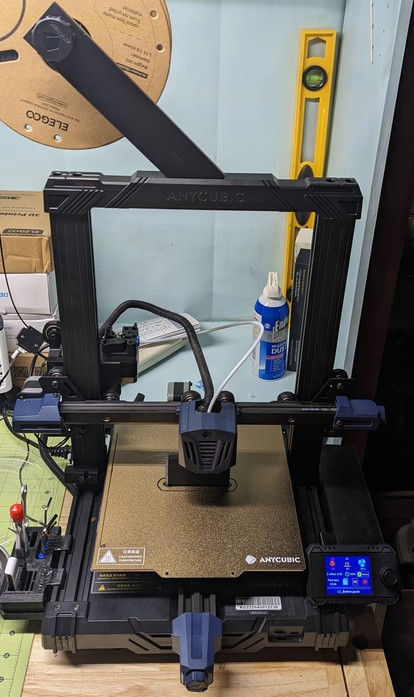

<link rel=”manifest” href=”docs/manifest.webmanifest”>

# Printers
The Anycubic [Kobra **Go**](https://www.anycubic.com/collections/3d-printers/products/kobra-go) and [Kobra **Neo**](https://www.anycubic.com/collections/3d-printers/products/kobra-neo) are pretty much identical FDM bed slinger printers, the only *real* difference seems to be the different type of extruder and the different home position:  
  
- The Kobra **Go** uses a bowden drive extruder ([user manual Kobra **Go**](https://cdn.shopify.com/s/files/1/0245/5519/2380/files/Anycubic_Kobra_Go_User_Manual_221102_V0.0.4.pdf?v=1667812989)), the home position is the front right corner of the bed.  
- The Kobra **Neo** uses a direct drive extruder ([user manual Kobra **Neo**](https://cdn.shopify.com/s/files/1/0245/5519/2380/files/Anycubic_Kobra_Neo_20230109_V0.1.0_English.pdf?v=1673859391)), the home position is the front left corner of the bed.  
  
??? tip "Be Aware of Different Settings"

    Because of the different types of extruder systems you have to be aware of certain settings like in the slicer you're using and also in alternative firmware like Klipper. In both cases you need to keep an eye on the rectration distance - this is *very* important!  
    *The profile (for the slicer) for the* ***Neo*** *Anycubic is offering has a* ***wrong*** *retraction distance set!*  
    In general, the retraction distance at bowden drives like the **Go** is set to a higher value (up to ~6mm) than at direct drives like the **Neo** (up to ~1mm). The profile from Anycubic has this set to 6mm for the **Neo** as well though - you'll need to change that before starting to print!  
    Please see the section ["Retraction Settings"](calibration.md#retraction-settings) for further information.  
    This is also something you should keep in mind when you're asking in a forum and get tips from other users - they might not be correct when it comes down to retraction distance!  
   
<!---
    - If you want to use other *firmware* than the stock one like Klipper and you're looking out for about how other users set the configuration, be aware of the fact that the **Go** has its home position with the printhead above the right front corner and the **Neo** at the left front corner of the bed (which is driven completely to the back at that time).    
-->
    
The **Go** comes completely unmounted so you have to mount everything together by yourself. Therefore the price of the **Go** usually is a bit lower than the price of the **Neo**.  
The Kobra **Neo** comes pre-mounted, you only have to mount a few parts like the 'upstanding' frame onto the base frame.  
  
See [Anycubic's support page](https://www.anycubic.com/pages/firmware-software) or [Anycubic's support page of the blog](https://www.anycubic.com/blogs/news/all-you-need-to-know-about-kobra-series) of the Kobra series to find manuals, firmware, video tutorials and more of both the **Go** and the **Neo**.    
  
The following list gives an overview of the most important specifications:    
  
- Printing dimension: 250 x 220 x 220 mm (HxWxD) 
- Printing platform: 8.7 x 8.7inches / 220 x 220mm (*Attention: the physical dimensions of the bed and the PEI plate are 230x230mm!*) 
- Machine dimensions: 490 x 445 x 443 mm (plus filament holder mounted to the upper frame = approx. 630 mm height) 
- Machine weight: approx. 7.5 kg  
- Aluminum frame  
- X-axis and Y-axis: belt driven, belt tension can be adjusted by knobs  
- Z-axis: single threaded rod  
- Printing speed: ≤100 mm/s (Max speed)  
- Control panel: 2.4" LCD screen with a control knob  
- Mainboard: TriGorilla V_3.0.6, 32bit, 24V, TMC2208 silent stepper drivers (soldered), microSD card reader, USB-C connector 
- Extruder / feeder system:  
    - Bowden separated at Kobra **Go**  
    - Direct drive at Kobra **Neo**  
- Heated aluminum bed with a magnetic foil glued onto it, comes with a removable PEI-coated spring steel plate (one-sided coated at **Go**, double-sided coated at **Neo**); *physical dimensions: 230x230mm*  
- Hot bed temperature: ≤ 230 °F / 110 °C  
- Bed leveling: "Anycubic LeviQ", which is a 25-point bed level measuring process 
- Power supply: 400W, 24V DC output, suitable for 110V/230V AC input (set the correct voltage with a switch before using it!)
- Printing material: PLA / ABS / PETG & TPU (optional housing recommended for certain material)  
- Single nozzle in a E3D **V5** type hotend, filament diameter 1.75 mm  
- Comes with a E3D V6 compatible 0.4 mm brass nozzle which is replaceable  
- Nozzle temperature: ≤ 500 °F / 260 °C  
- Optional filament run-out detection sensor  

  
| Kobra **Go** | Kobra **Neo** |
|--------------|---------------|
|  |  | 

