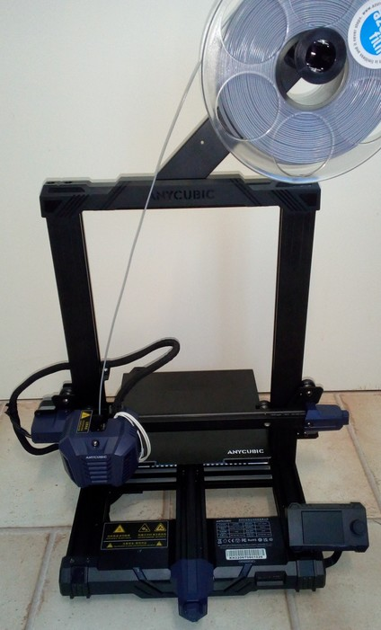

<link rel=”manifest” href=”docs/manifest.webmanifest”>

# Printers
The Anycubic [Kobra **Go**](https://www.anycubic.com/collections/3d-printers/products/kobra-go) and [Kobra **Neo**](https://www.anycubic.com/collections/3d-printers/products/kobra-neo) are pretty much identical FDM bed slinger printers, the only real difference seems to be the different type of extruder:  
  
- The Kobra **Go** uses a bowden drive extruder ([user manual Kobra **Go**](https://cdn.shopify.com/s/files/1/0245/5519/2380/files/Anycubic_Kobra_Go_User_Manual_221102_V0.0.4.pdf?v=1667812989)).  
- The Kobra **Neo** uses a direct drive extruder ([user manual Kobra **Neo**](https://cdn.shopify.com/s/files/1/0245/5519/2380/files/Anycubic_Kobra_Neo_20230109_V0.1.0_English.pdf?v=1673859391)).  
  
The price of the **Go** usually is a bit lower than the price of the **Neo**.  
The **Go** comes completely unmounted so you have to mount everything together by yourself. The Kobra **Neo** comes pre-mounted, you only have to mount a few parts like the frame for the x-axis (where the printhead is mounted to) onto the base frame.  
  
See [Anycubic's support page](https://www.anycubic.com/pages/firmware-software) or [Anycubic's support page of the blog](https://www.anycubic.com/blogs/news/all-you-need-to-know-about-kobra-series) of the Kobra series to find manuals, firmware, video tutorials and more of both the **Go** and the **Neo**.    
  
The following list gives an overview of the most important specifications:    
  
- Printing dimensions: 250 x 220 x 220 mm (HxWxD)  
- Machine dimensions: 490 x 445 x 443 mm (plus filament holder mounted to the upper frame = approx. 630 mm height) 
- Machine weight: approx. 7.5 kg  
- Aluminum frame  
- X-axis and Y-axis: belt driven, belt tension can be adjusted by knobs  
- Z-axis: single threaded rod  
- Printing speed: ≤100 mm/s (Max speed)  
- Control panel: 2.4" LCD screen with a control knob  
- Mainboard: TriGorilla V_3.0.6, 32bit, TMC2208 silent stepper drivers (soldered), microSD card reader, USB-C connector 
- Extruder / feeder system:  
    - Bowden separated at Kobra **Go**  
    - Direct drive at Kobra **Neo**  
- Printing platform: 8.7 x 8.7 inches / 220 x 220 mm  
- Heated and magnetic bed with removable PEI-coated spring steel plate (one-sided coated at **Go**, double-sided coated at **Neo**)  
- Hot bed temperature: ≤ 230 °F / 110 °C  
- Bed leveling: "Anycubic LeviQ", which is a 25-point automatic bed leveling  
- Printing material: PLA / ABS / PETG & TPU (optional housing recommended for certain material)  
- Single nozzle in a V5 heater block, filament diameter 1.75 mm  
- Comes with a E3D V6 compatible 0.4 mm brass nozzle which is replaceable  
- Nozzle temperature: ≤ 500 °F / 260 °C  
- Optional filament run-out detection sensor  

Because a picture says more than thousand words - let me introduce you to my first 3D printer ever, the Kobra **Neo**:  

